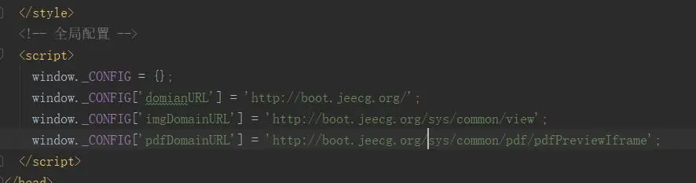
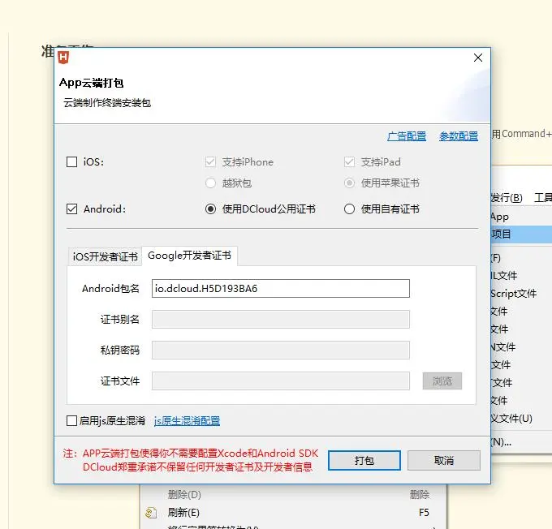
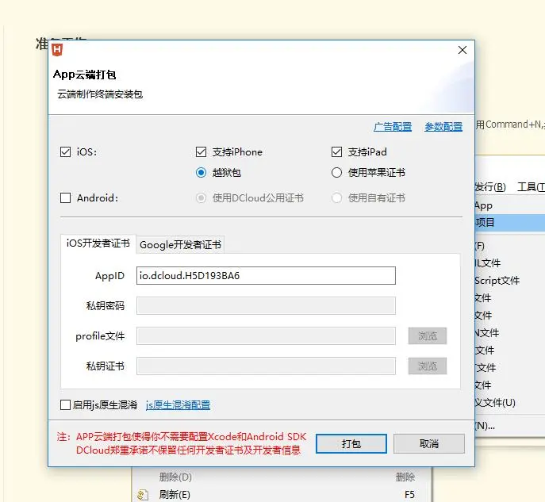
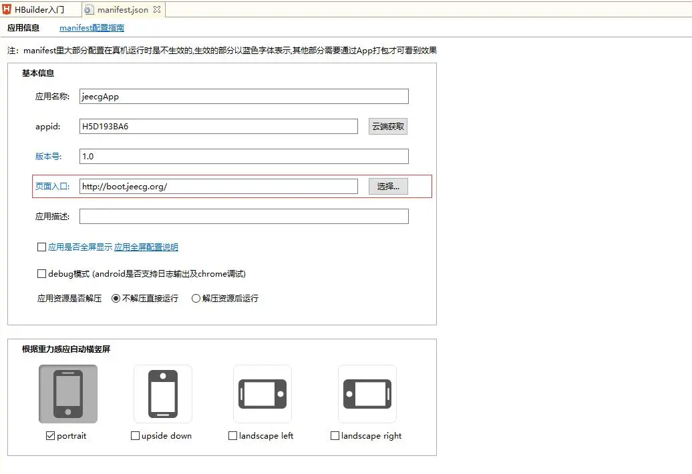

HBuilder打包APP手机端安装配置教程
===

> jeecgBoot前端UI项目，可以打成app安装手机上，采用HBuilder工具，详细步骤如下

第一步：
在vue.config.js中加入 baseUrl: './', 代码示例如下图：

修改public目录下index.html文件把全局配置的地址改成域名。如下图

修改src/utils/request.js

把axios 的baseURL修改一下,如下示例图：

第二步：
在HBuilder中选择文件—>打开目录，选择build后的dist文件，如下图：

第三步：
选中项目，右击选择转换成移动App
第四步：
选中项目，右击选择发行，弹出来菜单，选择第一项。出现一个窗口如下图： 点击打包，即可完成打包

下面是苹果打包截图：

如果打包的app访问不到后台数据，请修改HBuilder中的配置文件，如下图

