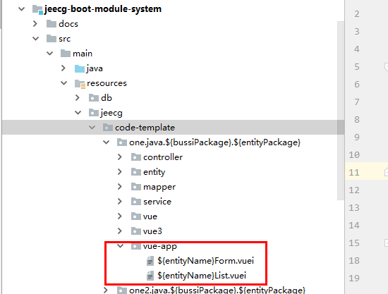
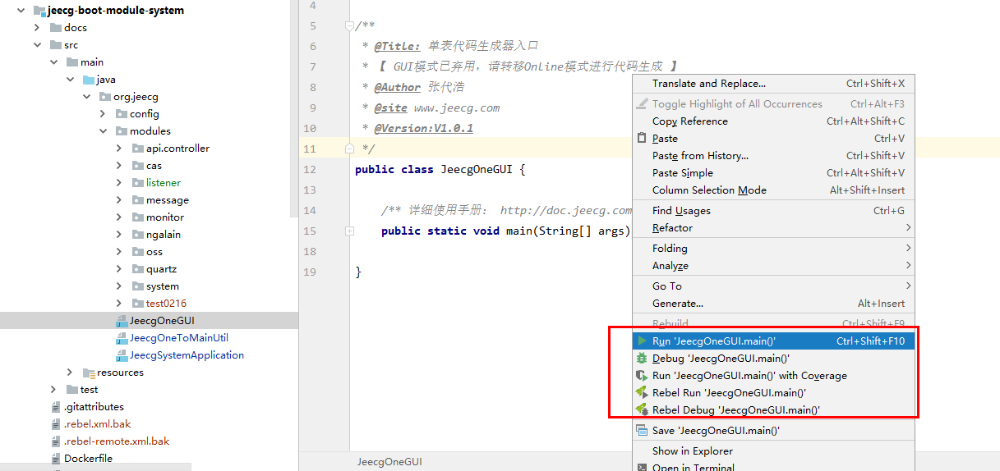
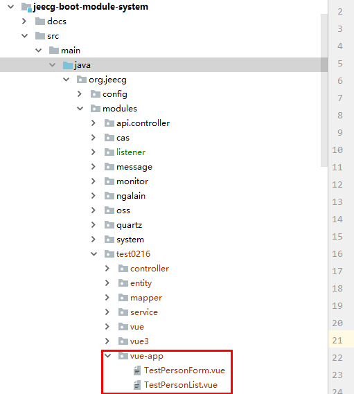

## 代码生成APP列表和表单页面
> 需要手工创建表

* app模板位置

* 代码生成到的目录配置

* 使用单表GUI代码生成工具
1.   找到jeecg-boot-module-system/src/main/java/org/jeecg/JeecgOneGUI.java，位置如下图所示

2. 右击，运行

3. 会出现下图所示工具，根据提示填写表信息，然后点击’生成‘

4. 代码会生成到你指定的目录下
 
5. 将这两个文件复制到前端开发项目中即可