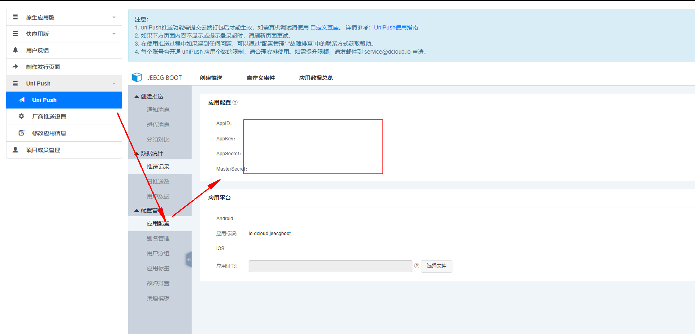

org.jeecg.modules.eoa.config.UniappConstant

### 1.UniPush开通指南
https://ask.dcloud.net.cn/article/35716

### 2.UniappConstant配置简介：

#### 2.1 appid等配置的获取：
unipush 开通后可以获取到appid、appkey、masterSecret的配置信息，可在下图位置找到

#### 2.2 intent配置：
使用厂商推送下发推送消息必须设置intent，并且intent须符合以下格式，此格式时在个推定义额基础上二次封装，所以必须以此格式为准。不按此格式设置intent可能出现用户点击推送消息无法启动APP的问题。  
intent数据格式如下：
~~~
intent:#Intent;action=android.intent.action.oppopush;launchFlags=0x14000000;component=io.dcloud.HBuilder/io.dcloud.PandoraEntry;S.UP-OL-SU=true;S.title=测试标题;S.content=测试内容;S.payload=test;end
~~~

**其中io.dcloud.HBuilder为APP包名，需要替换为自己APP的包名；**  
S.title=的值为推送消息标题，对应5+ API中[PushMessage](https://www.html5plus.org/doc/zh_cn/push.html#plus.push.PushMessage)对象的title属性值；  
S.content=的值为推送消息内容，对应5+ API中[PushMessage](https://www.html5plus.org/doc/zh_cn/push.html#plus.push.PushMessage)对象的content属性值；  
S.payload=的值为推送消息的数据，对应5+ API中[PushMessage](https://www.html5plus.org/doc/zh_cn/push.html#plus.push.PushMessage)对象的payload属性值；  
**launchFlags=0x14000000字段，解决接收多条通知后点击可能无法触发click事件的问题**

注意事项：
*   intent格式与个推的多厂商pdf文档中描述的不一样，以此格式为准
*   intent是为了兼容Android平台的数据，但为了保持兼容性，建议iOS平台也配置此数据
*   action=android.intent.action.oppopush为固定的数据，是兼容oppo设备的离线推送功能，不需要修改
*   component=io.dcloud.HBuilder/io.dcloud.PandoraEntry中的io.dcloud.HBuilder为应用的包名，与App云端打包界面设置的Android包名一致

*部分内容节选自，跳转可参考详情：https://ask.dcloud.net.cn/article/35622*

### 3.服务端接入步骤
**STEP1：** 获取应用基本信息：AppId、AppKey、masterSecret。
**STEP2：** 设置推送标题、推送内容
**STEP3：** 设置响铃、震动等推送效果
**STEP4：** 选择通知模板
**STEP5：** 设置推送消息有效期等推送参数
**STEP6：** 执行推送
**STEP7：** 打开手机查看通知栏消息

#### **代码示例：**
import com.gexin.rp.sdk.base.IPushResult;
import com.gexin.rp.sdk.base.impl.AppMessage;
import com.gexin.rp.sdk.http.IGtPush;
import com.gexin.rp.sdk.template.LinkTemplate;

import java.io.IOException;
import java.util.ArrayList;
import java.util.List;

public class AppPush {

    // STEP1：获取应用基本信息
    private static String appId = "";
    private static String appKey = "";
    private static String masterSecret = "";
    // 如果需要使用HTTPS，直接修改url即可
    //private static String url = "https://api.getui.com/apiex.htm";
    private static String url = "http://api.getui.com/apiex.htm";

    public static void main(String[] args) throws IOException {

        IGtPush push = new IGtPush(url, appKey, masterSecret);

        Style0 style = new Style0();
        // STEP2：设置推送标题、推送内容
        style.setTitle("请输入通知栏标题");
        style.setText("请输入通知栏内容");
        style.setLogo("push.png");  // 设置推送图标
        // STEP3：设置响铃、震动等推送效果
        style.setRing(true);  // 设置响铃
        style.setVibrate(true);  // 设置震动

        // STEP4：选择通知模板
        NotificationTemplate template = new NotificationTemplate();
        template.setAppId(appId);
        template.setAppkey(appKey);
        template.setStyle(style);

        // STEP5：定义"AppMessage"类型消息对象,设置推送消息有效期等推送参数
        List<String> appIds = new ArrayList<String>();
        appIds.add(appId);
        AppMessage message = new AppMessage();
        message.setData(template);
        message.setAppIdList(appIds);
        message.setOffline(true);
        message.setOfflineExpireTime(1000 * 600);  // 时间单位为毫秒

        // STEP6：执行推送
        IPushResult ret = push.pushMessageToApp(message);
        System.out.println(ret.getResponse().toString());
    }
}

***具体服务端推送配置可参考个推文档：[http://docs.getui.com/](http://docs.getui.com/)。***

