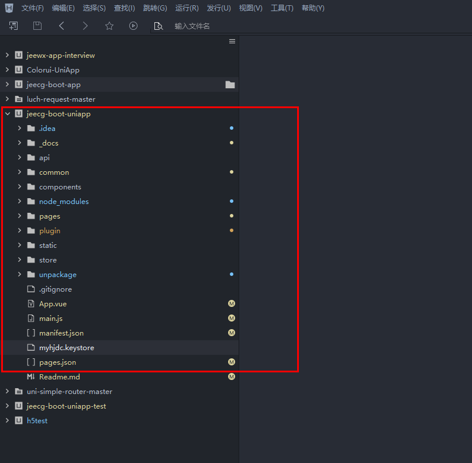
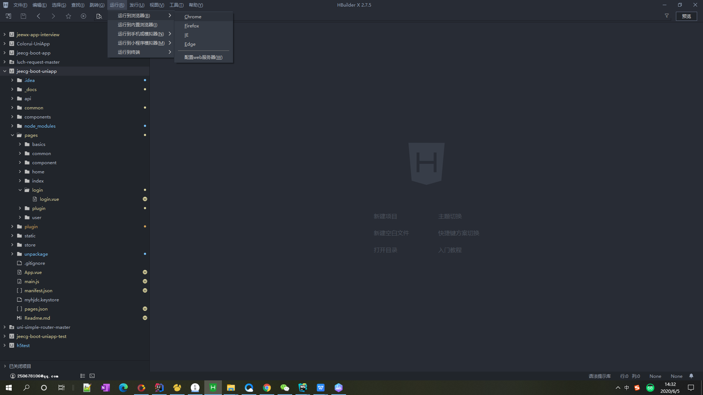
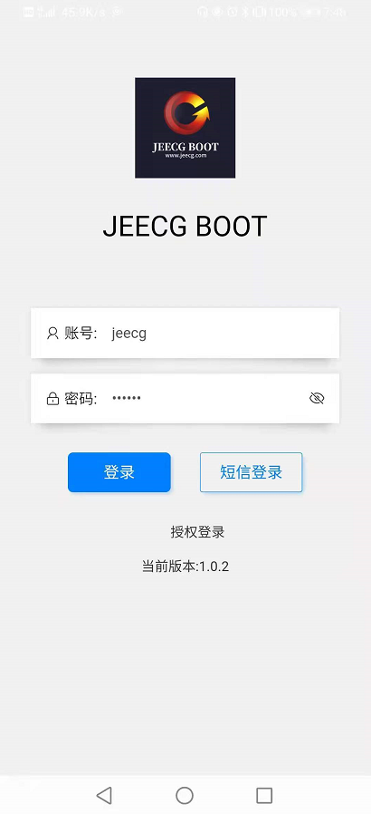

# 开发环境搭建

[TOC]

## 开发环境搭建
### 一、安装开发工具
安装HBuilderX 官方下载地址【[官方IDE载地址](https://www.dcloud.io/hbuilderx.html)】
安装教程【[安装教程](https://www.jianshu.com/p/6f59ad582a96)】
HBuilderX是通用的前端开发工具，但为uni-app制成特别强化。
下载App开发版，可开箱即用；如下载标准版，在运行或发行uni-app时，会提示安装uni-app插件，插件下载完成后方可使用。
### 二、项目
#### 1、使用HBuilderX导入项目
（1）前端工程jeecg-uniapp
（2）HBuilderX打开项目

（3）修改接口api

#### 2、运行uni-app
1.**浏览器运行**：进入jeecg-uniapp项目，点击工具栏的运行->运行到浏览器->选择浏览器，即可在浏览器里面体验uni-appH5版。

H5在开发环节，运行到外部浏览器可能会出现跨域的问题。
如果遇到跨域造成js无法联网，注意网络请求（request、uploadFile、downloadFile等）在浏览器存在跨域限制，解决方案有详见：[https://ask.dcloud.net.cn/article/35267](https://ask.dcloud.net.cn/article/35267)。

如果只是开发调试可以使用内置浏览器，没有跨域等的问题，首次使用内置浏览器可能会提示下载，运行成功后，可以在右侧看到相应的页面。

2.**在微信开发者工具里运行**：进入jeecg-uniapp项目，点击工具栏的运行->运行到小程序模拟器->微信开发者工具，即可在微信开发者工具里面体验jeecg-uniapp项目

注意：如果是第一次使用，需要先配置小程序ide的相关路径（见下图），才能运行成功。如下图，需在输入框输入微信开发者工具的安装路径。若HBuilderX不能正常启动微信开发者工具，需要开发者手动启动，然后将uni-app生成小程序工程的路径复制到微信开发者工具里面，在HBuilderX里面开发，在微信开发者工具里面就可以看到实时的效果。uni-app或将项目编译到根目录的unpackage目录。

3.真机运行：连接手机，开启USB调试，进入jeecg-uniapp项目，点击工具栏的运行->运行到手机或浏览器->选择运行的设备，即可在该设备里面体验uni-app。

运行成功后可在手机上看到页面

如手机无法识别，请点击菜单运行-运行到手机或模拟器-真机运行常见故障排查指南。运行前最好下载一个手机助手测试一下手机连接是否正常

