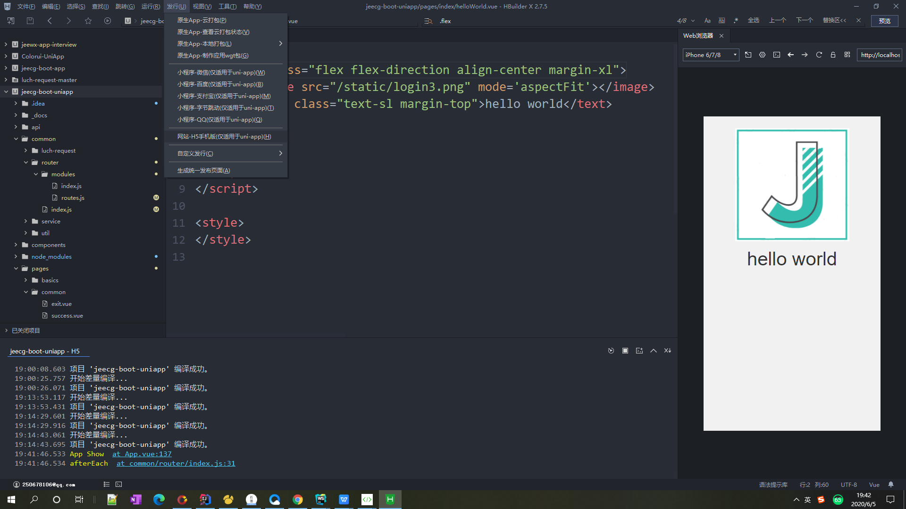

#### 打包为H5
在HBuilderX工具栏，，如下图：
这里我们是打包成H5的流程，所以我们选择网站-H5手机版这个选择

网站标题不要为空

在这里我们可以填写网站的标题和请求的域名 ，默认的话  他的指向是服务器的根目录。
比如你的域名是 www.test.com，那他的资源路径就是  www.test.com/static/xxx.文件后缀名字，那你的static文件就要放在服务器的根目录下面 ，但这样不利于文件管理。这个时候我们就要选择高级 进行H5配置
。

比如你在服务器的根目录创建个为 www.test.com/h5  那就在那个运行的路径上添加  /h5
这样的话 他资源的运行路径就是 www.test.com/h5/xxx.文件后缀名，在根目录创建多少级 这样的路径就对应多少级
然后我们重新点击发布我们就能得到两个文件夹
:

把这个放到服务器对应的 文件夹就可以了 然后访问服务器上对应的index.html就是H5页面了

