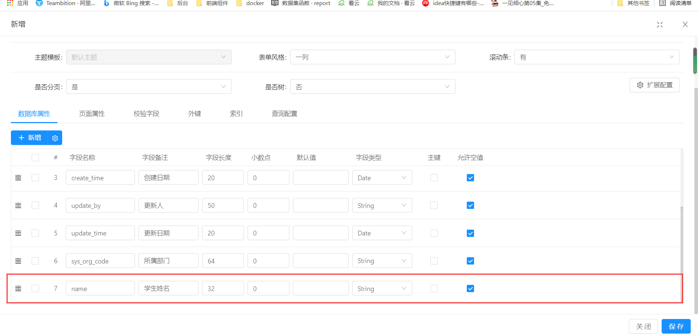
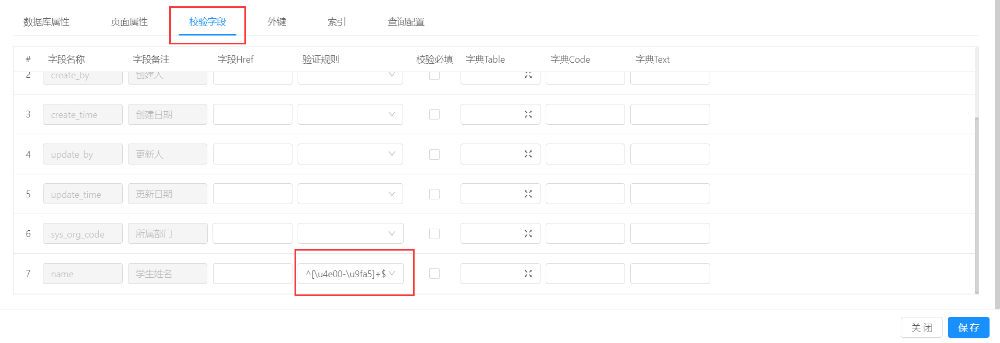
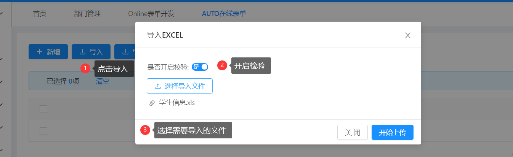

>导入检验：当我们在Online设计器设置了表单检验，需要导入的时候进行检验，不通过的不能导入，那么请参考此文章

## 效果展示
>只允许输入中文

>失败

>成功

## 新增online表单，表名叫做`student`，并添加字段

>添加一个`name`字段，名字叫`学生信息`

>添加自定义规则检验`^[\u4e00-\u9fa5]+$`，只允许输入中文

## 重点-> 在导入中选中是否开启检验
>点击功能测试

>开启检验，点击确定即可

效果展示
>失败

>成功

------------------------------

### 注意：
导入时，不作唯一校验，想要实现，只能在数据库表中设置字段的唯一索引。
