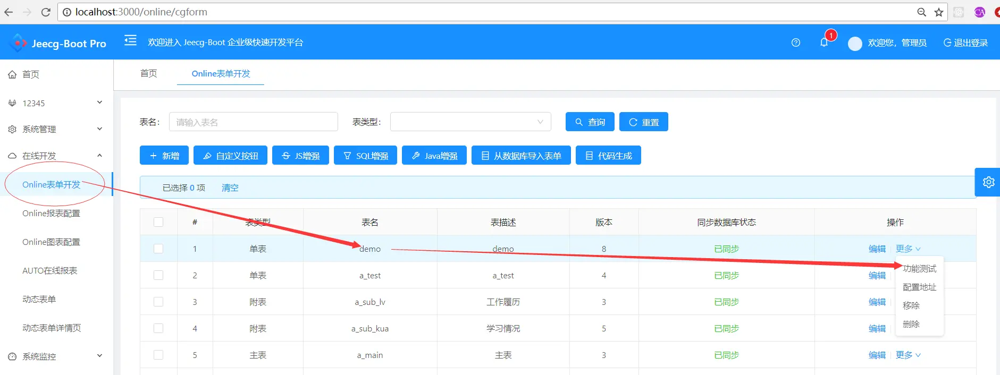
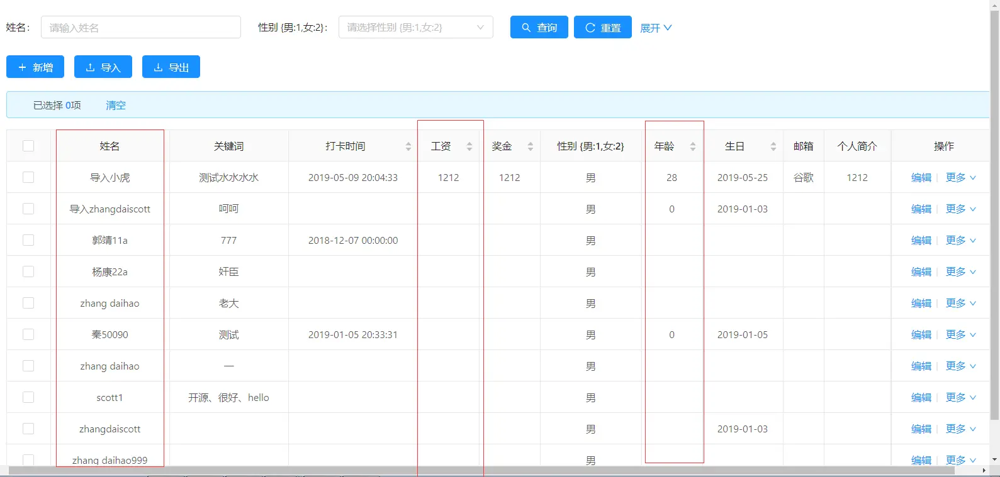
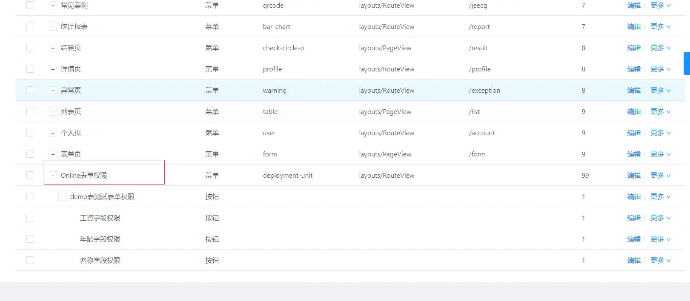
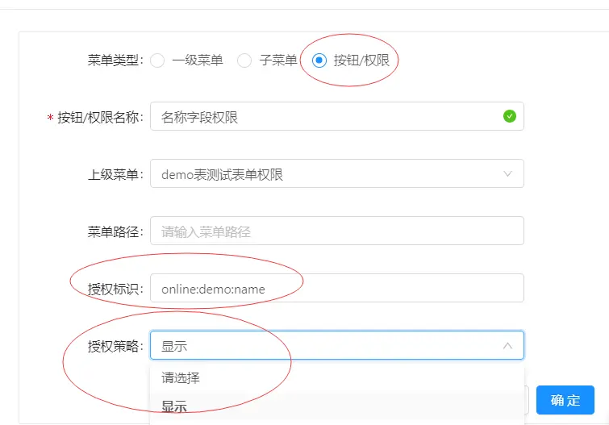
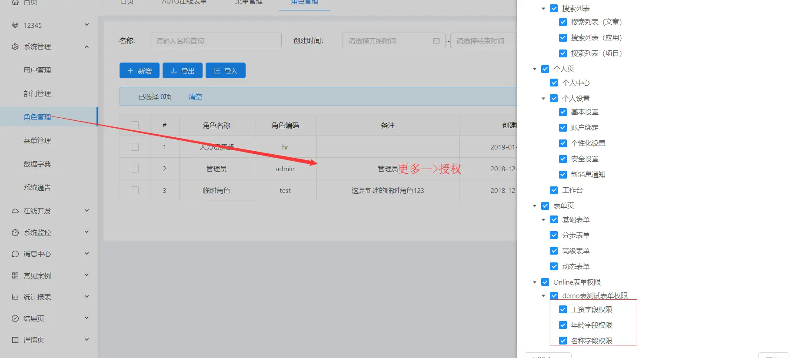
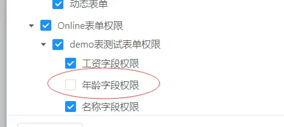
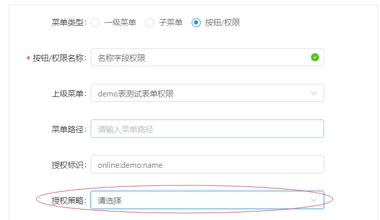
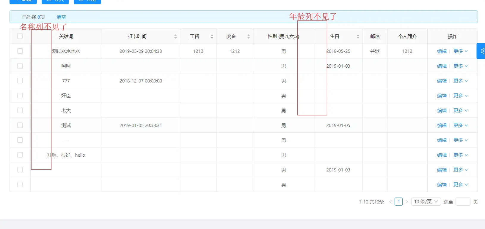

数据列字段权限控制（控制是否显示）
===
>[info] version`2.2` 

**目录索引：**

-  列表权限
   列表的某列字段显示与隐藏

```
   规则编码  =  online:表名:字段名
```


###  列字段显示/隐藏
> 以online的demo表为例，控制demo列表的字段{名字} {年龄} {工资}显示与隐藏。

- 目标： 进入online的demo表的信息维护界面，查看数据列（如下图1-2）

需要控制以下三个字段


- 1、配置权限菜单




> 注意：
> 1.Online表单字段权限菜单统一配置在Online表单权限这个菜单下
> 2.每个表单独配置一个按钮类型的父菜单如图2-1
> 3.每个字段权限的菜单必须填写授权标识，此标识声明规则为：online:表名:字段名 如图2-2

- 2、 角色授权


> 注意，以下两种情况的配置均会使列隐藏：
> 1.配置的权限菜单但是没有角色授权
> 2.配置了权限菜单且角色授权了，但是授权策略配置（见图2-2）没有选择显示

- 3、 针对上述两种情况配置年龄/名称字段使其隐藏，分别将年龄字段的角色授权取消、名称字段授权策略配置成不显示


- 4.查看测试结果：对比图1-2可知权限控制有效



