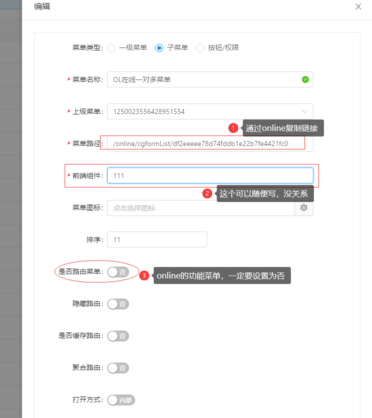
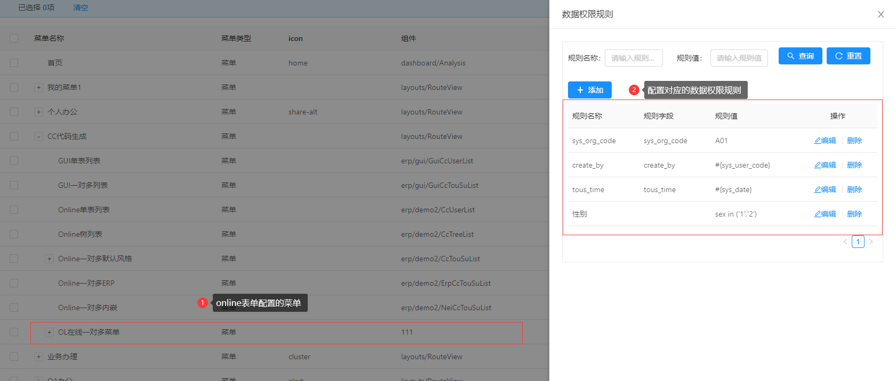
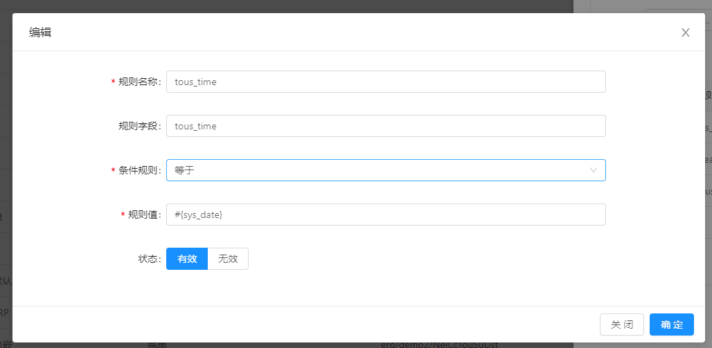
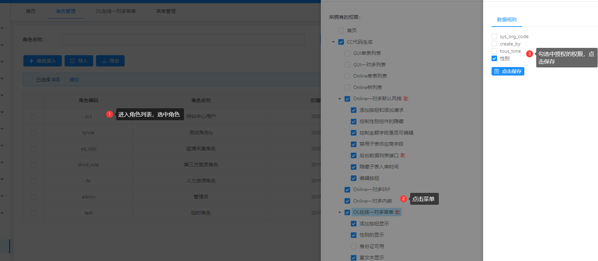
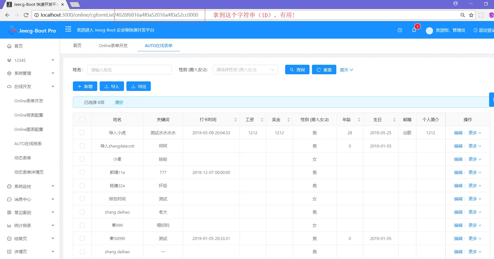
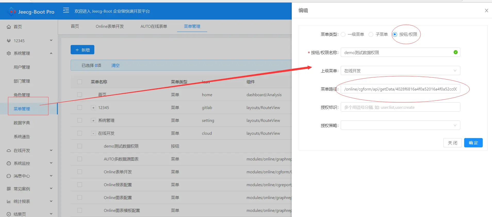
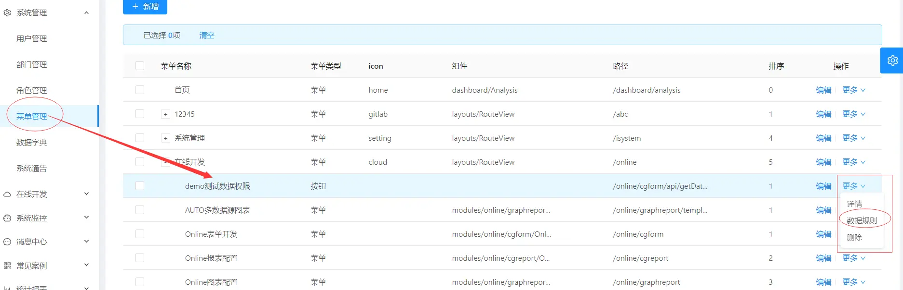
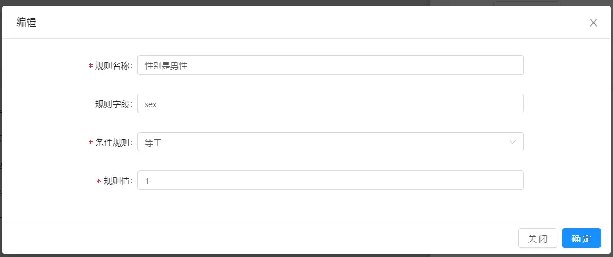
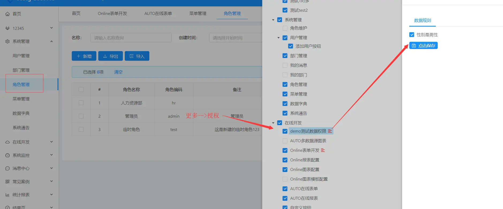
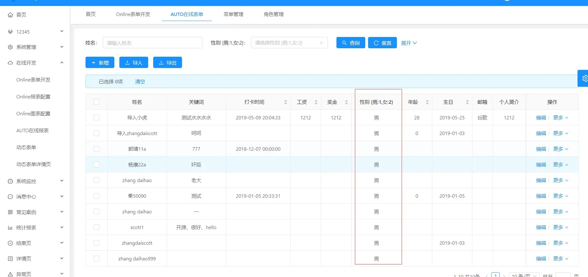

Online表单数据权限
===
>[info] version`2.2` 

> 注意：2.2+的版本支持这种模式，简化了配置，老版本请参考下面作废模式。
#### 1.创建Online表单的菜单

#### 2.为上一步的菜单，配置数据规则

#### 4.菜单和数据权限授权（先勾选菜单保存后再操作菜单的数据权限）

#### 5.重新进入菜单测试页，测试结果如下：
 退出重新登录，发现数据权限控制生效

*****    
*****
*****
>  以下模式作废，不建议使用
> 注意：2.2以前的版本必须用这个模式。

##### ~~以online表单的demo表为例演示数据权限的配置~~
#### 1.进入online的demo表的信息维护界面

#### 2.拿到上图ID：4028f6816a4f0a52016a4f0a52cc0000 配置权限菜单：

> #### 此处有两点注意（如上图圈圈）：
#### 1.菜单类型选择：按钮/权限 类型
#### 2.菜单路径配置为： /online/cgform/api/getData/ + 图1-2中的ID字符串

#### 3.配置菜单数据规则（此处配置一个的数据规则：筛选性别为男性的数据）

#### 4.菜单授权（先勾选菜单保存后再操作菜单的数据权限）

#### 5.重新进入demo测试页，测试结果如下：

#### 附录：

[上下文变量参考]([http://doc.jeecg.com/1273976](http://doc.jeecg.com/1273976))

