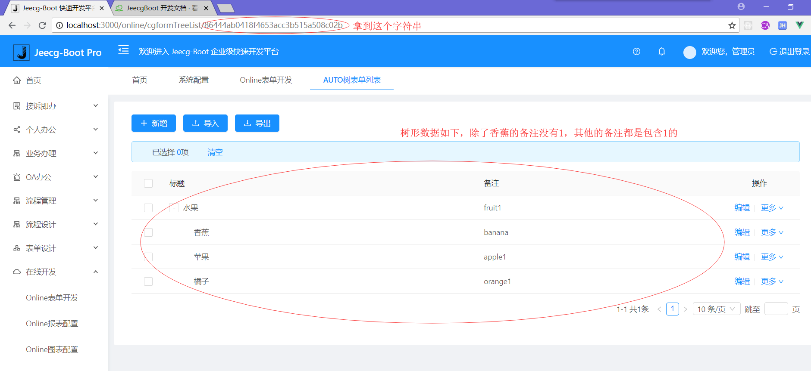
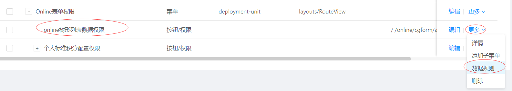
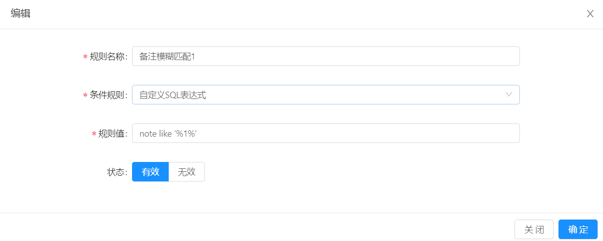
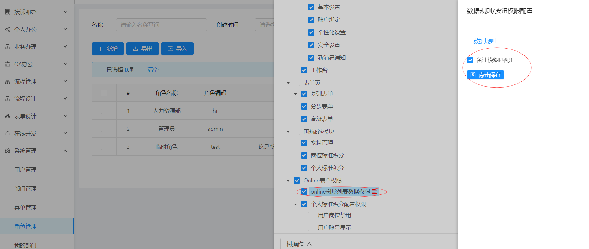
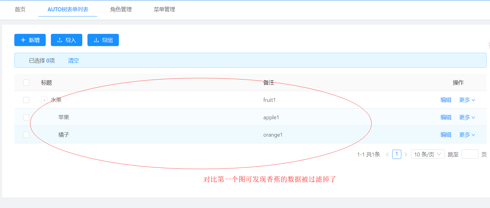

Online树形表单数据权限
===
>[info] version`2.2` 

##### 以online的测试表单为例
#### 1.进入online的树形表单页面

#### 2.拿到上图ID：86444ab0418f4653acc3b515a508c02b 配置权限菜单：

> #### 此处有两点注意（如上图圈圈）：
#### a.菜单类型选择：按钮/权限 类型
#### b.菜单路径配置为： /online/cgform/api/getTreeData/ + 上图中拿到的字符串
>

#### 3.配置菜单数据规则（此处配置一个的数据规则：筛选性别为男性的数据）

#### 4.菜单授权（先勾选菜单保存后再操作菜单的数据权限）

#### 5.重新进入列表页面，测试结果如下：

