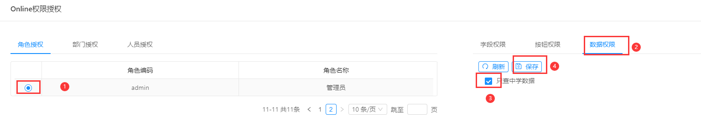
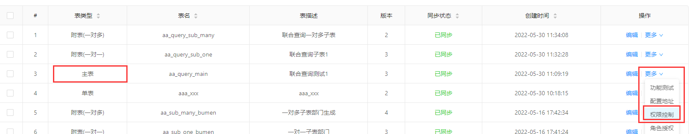

联合查询下，数据权限配置有些特殊的使用规则
### 准备示例数据
设计表如下：
- 主表：

|   字段     |说明     |
| --- | --- |
|    name|   名称  |
|    age|   年龄  |

- 一对多子表(附表序号1)：

|   字段     |说明     |
| --- | --- |
|    school|   学校  |
|    phone|   联系方式  |

- 一对一子表(附表序号2)：

|   字段     |说明     |
| --- | --- |
|  nation  |   名族|
|  place  |   籍贯 |

- 联合查询结果数据一览： 

### 需求： 只查询学校为【中学】的数据，即一对多子表字段school='中学'

### 示例一、在子表上配置数据规则及相关授权
1.找到该子表记录，在更多选项中找到权限控制，点击

2.录入数据规则

3.授权

4.查看数据：

###  示例二、在主表配置自定义sql，查询子表字段
1.找到主表记录，在更多选项中找到权限控制，点击

2.录入数据规则

3.授权

4.查看数据：

>[info] 总结： 
> 1.可以在子表上直接配置数据权限
> 2.可以在主表上配置自定义sql，sql中查询表的别名是根据表的顺序，由26个字母依次排序的。主表的别名一定是字母`a`，子表的别名取决于他的序号，序号从小到大，会依次分配`b,c,d...z`。上例中，一对多子表的序号是1，所以自定义sql中查询他的字段用的别名是`b`

