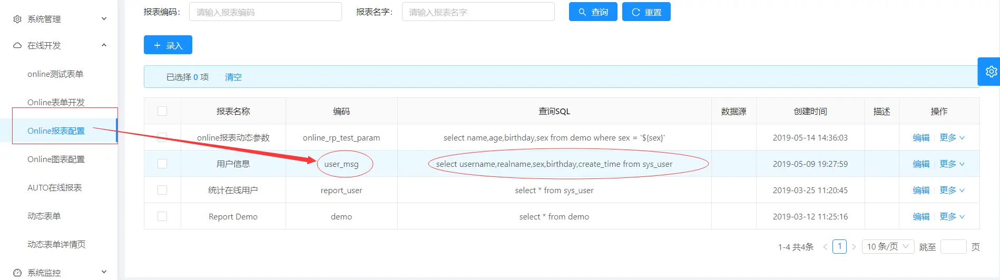
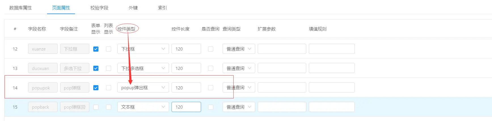
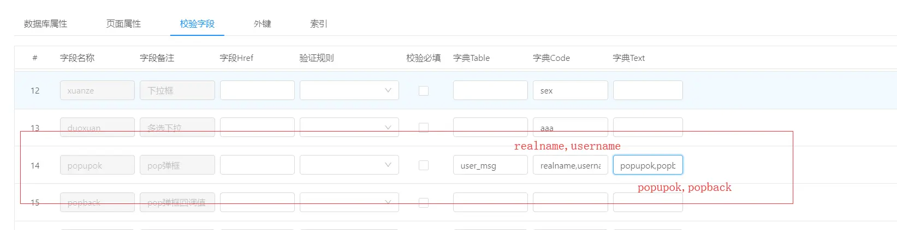

Popup控件
===

Popup控件
_popup选择框的使用依赖于Online报表_
（1）创建一个Online报表来提供弹出数据列表的数据集

（2）选择控件类型为popup弹出框

（3）字典Table、字典Code、字典Text项填写对应的Online报表信息
```
字典Table : 填写Online报表编码
字典Code:  填写Online报表中的字段名（多个逗号隔开）
字典Text:   填写表单中字段名 （多个逗号隔开）
如下设置：
把报表user_msg查出的字段 realname,username 选择后分别写入表单中popupok和popback
```

（4）展示效果

点击输入框弹出报表列表

选择后数据带入表单


