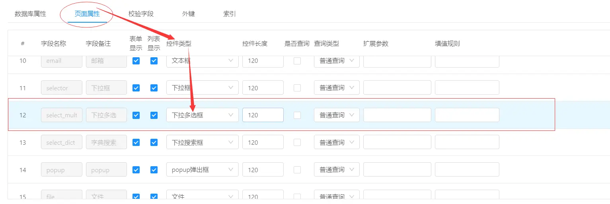
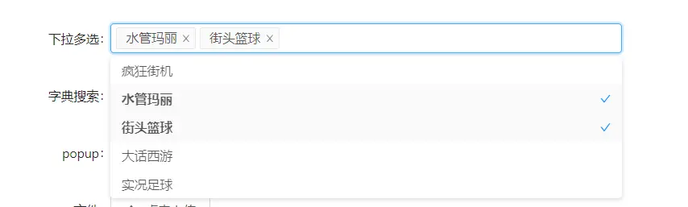
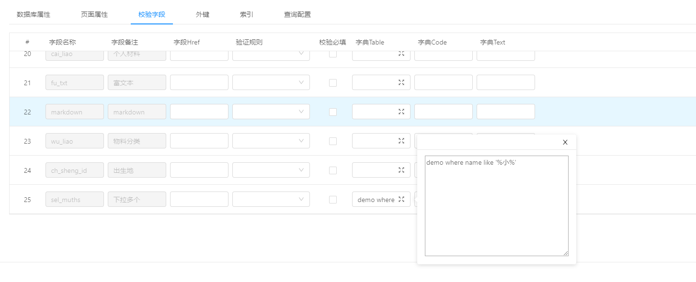
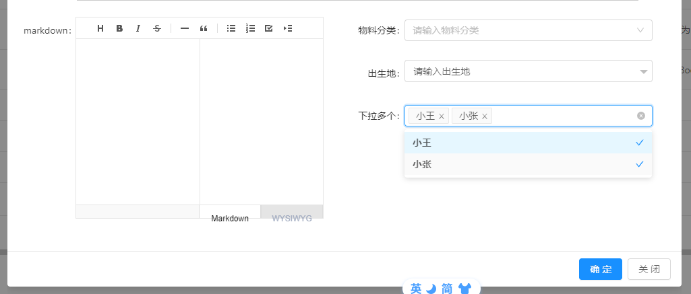

下拉多选
===
> 实现功能： 表单字段，通过系统配置字典，展示下拉，支持多选
> 支持模型:  支持系统数据字典和表字典（不支持popup）

### 1. 系统字典

首选配置表单字段页面控件类型：

配置字字典：

字段code对应： 系统管理 -> 数据字典

演示：

### 2. 表字典 

> demo 是表名
> id 是下拉value
> name 是下拉文本

* 表字典配置

* 支持带条件

* 效果：

