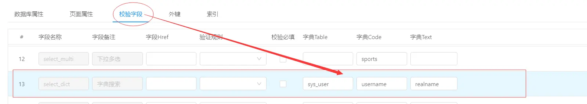
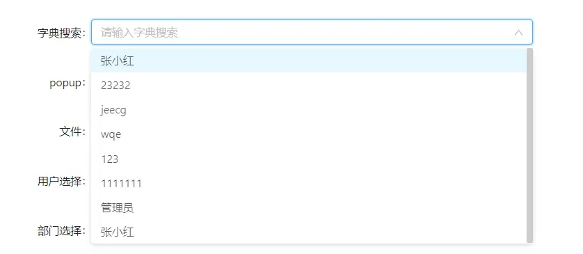
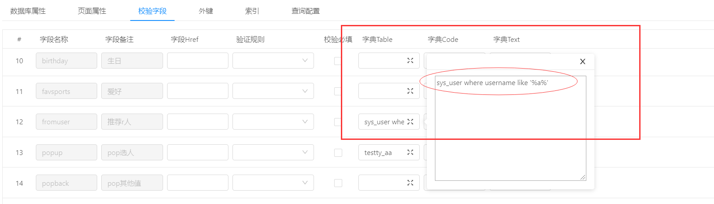

下拉搜索
===
> 为**字典表**提供的一个可以搜索的组件，字典table、code、text都需要配置
> 支持模型:  只支持表字典（不支持popup）

- 1.页面属性配置控件类型

- 2.校验字段配置字典表

- 3.演示，默认加载所有数据(下图1),可输入j进行筛选(下图2)  

---
**新增功能 3.4.5+：支持自定义sql 增加查询条件 过滤表数据**
配置方式，如图所示在字典table上接表名后配置where[**where 一定要小写**] 条件：

