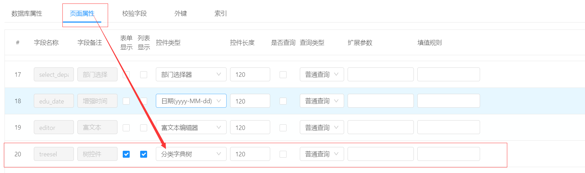
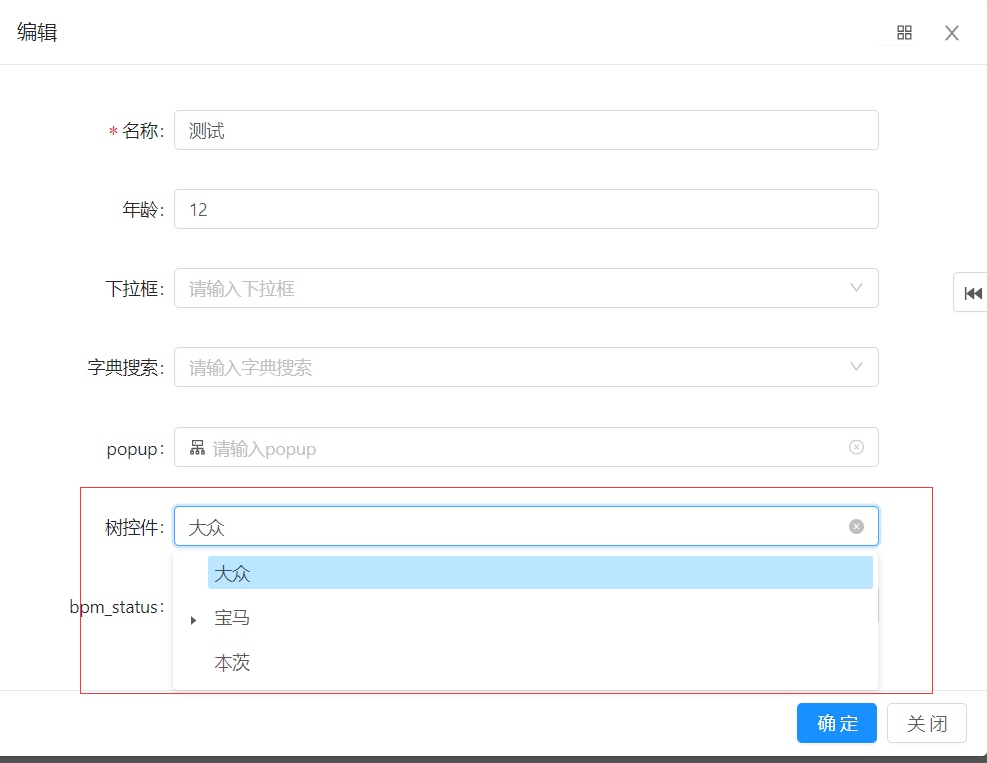
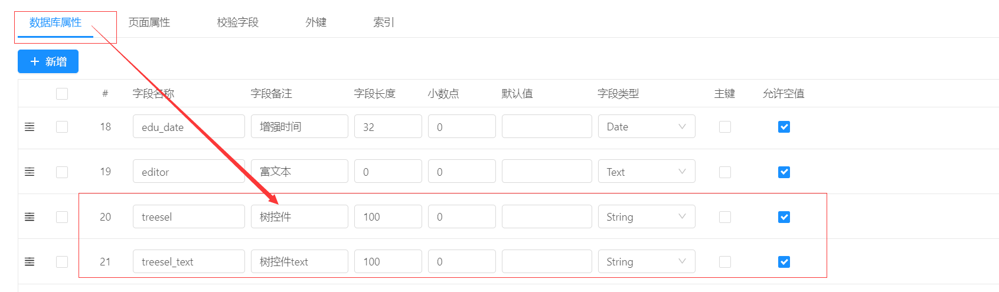
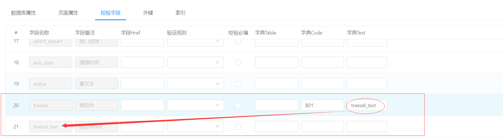

分类字典树控件

===
**简述：**
1.分类字典树控件是基于 系统表分类字典设计的，为online提供一个树控件，用于选择分类字典的数据。
2.分类字典的数据维护见菜单【系统管理】-->【分类字典】：

**使用：**（有两种类型，用户请根据自己需求不同场景采用适用的方法）
一、只保存ID，列表及表单回显数据需要系统翻译，适用于小数据量，可保证当前表数据及分类字典表数据一致。
- online配置:

*此方案需要配置字典code的值，该值实际是分类字典的**类型编码**，此处配置成B01即表示当前这个树控件，只加载B01节点以下的数据*
- 演示：

二、保存ID和text ，列表及表单展示text，适用于大数据量，但是若分类字典表数据text被修改，当前表则难以保证数据一致性

- 数据库属性配置

- 页面属性配置控件类型

- 校验字段配置字典

备注：
1、数据库属性配置两个字段，一个存储树text一个存储树id
2、页面属性配置成分类字典树，列表表单显示，text为文本框，列表表单不显示
3、字典code配置成分类字典的**类型编码**，同一；字典text配置存储树text字段的名称

- 3.演示，

