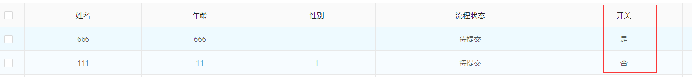

开关控件：
用于场景：只有两个选项且只能选一个
默认选项值： Y/N (即数据库字段存储为Y或N)
配置：

配置注意：
- 控件类型选择：开关
- 扩展参数：如果不想使用默认的选项值(Y/N)保存到数据库，支持自定义,配置一个数组即可,

 例如：配置数组 `[1,2]` 则第一个参数(1)对应是，第二个参数(2) 对应否 那么保存在数据库的字段值为1/2

列表显示：

单表/主表/一对一子表 表单效果展示：

一对多子表 表单效果展示：（勾选即Y）

