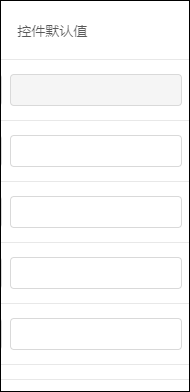
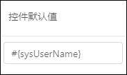
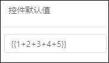
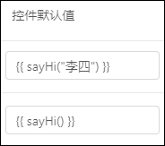

# Online控件默认值表达式规则

[TOC]

在`页面属性`中，有一列是`控件默认值`的输入框。

## 各种用法规则

### 一、纯字符串

直接输入任意字符串，在新增时就会把内容填充到输入框内。

配置： 
效果： 

### 二、填值规则表达式

`${...}` 是填值规则的表达式
 具体参考 [填值规则文档 ](http://doc.jeecg.com/2044064)

### 三、系统上下文变量（普通表达式）

`#{...}` 是普通表达式

配置：
效果：

在`#{}`内可以使用的变量分别有：

* `sysUserId`：当前登录用户的ID
* `sysUserCode`：当前登录用户的username
* `sysUserName`：当前登录用户的真实姓名（realname）
* `sysOrgCode`：当前登录用户的部门编号
* `date`：当前系统日期（例：2020-01-12）
* `time`：当前系统时间（例：12:01:51）
* `datetime`：当前系统日期时间（例：2020-01-12 12:01:51）

### 四、自定义JS表达式

`{{...}}`是自定义JS表达式

在这个双大括号内可以填写简单的JS表达式，该表达式的最终执行结果就是控件的默认值。

配置：
效果：

但是如果需要更高级JS表达式，例如定义变量、逻辑判断等，则需要你写一个自定义方法来调用。
自定义方法必须要写到 `src/utils/CustomExpression.js` 文件中，且要 `export` 才能在表达式中使用。

示例：
配置：
效果：

> 注：执行方法必须加括号`()`，括号内可以传参数

## 各个表达式之间的注意事项

* `填值规则表达式`之外的其他表达式都可以混合使用。
* `填值规则表达式` 只可以和纯字符串混用，和其他表达式混用则不解析。
* `填值规则表达式`一个字段里只能填写一个，填写多个不解析。
* `自定义JS表达式`内部只能写简单的JS表达式，例如加减乘除、三元表达式、调方法等。
* `自定义JS表达式`自定义方法必须要写到 `src/utils/CustomExpression.js` 文件中，且要 `export` 才能在表达式中使用。
* 如果写了`自定义JS表达式`，并且 `export` 了，但是没有识别，那么请刷新后重试。