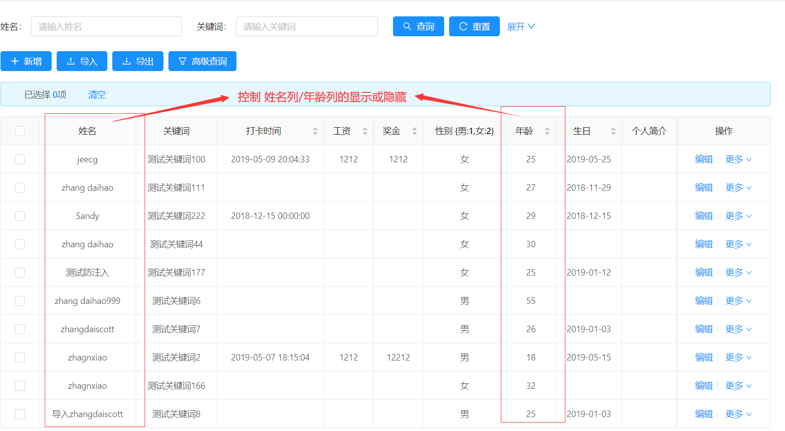
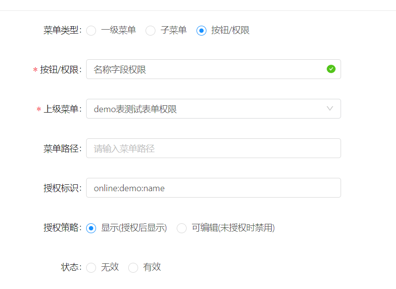
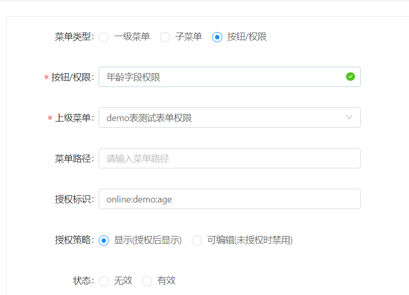
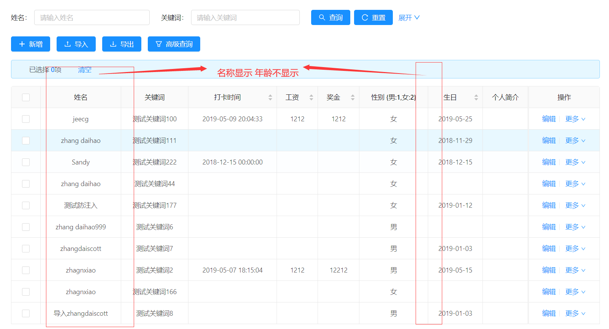

```
   授权标识  =  online:表名:字段名
```

> 以online的demo表为例，控制demo列表的字段{名字} {年龄}显示与隐藏。
1.进入online的demo表的信息维护界面，查看数据列（如下图)

2.进入菜单管理界面，新增权限菜单【demo表测试表单权限】

3.在【demo表测试表单权限】下配置权限菜单



> 注意：
> 1.Online表单字段权限菜单统一配置在Online表单权限这个菜单下
> 2.每个表单独配置一个按钮类型的父菜单,例如这里的【demo表测试表单权限】
> 3.每个字段权限的菜单必须填写授权标识，此标识声明规则为：online:表名:字段名 

4. 进入角色管理，进行角色授权

5.再次进入online的demo表的信息维护界面，查看数据列显示如下：



