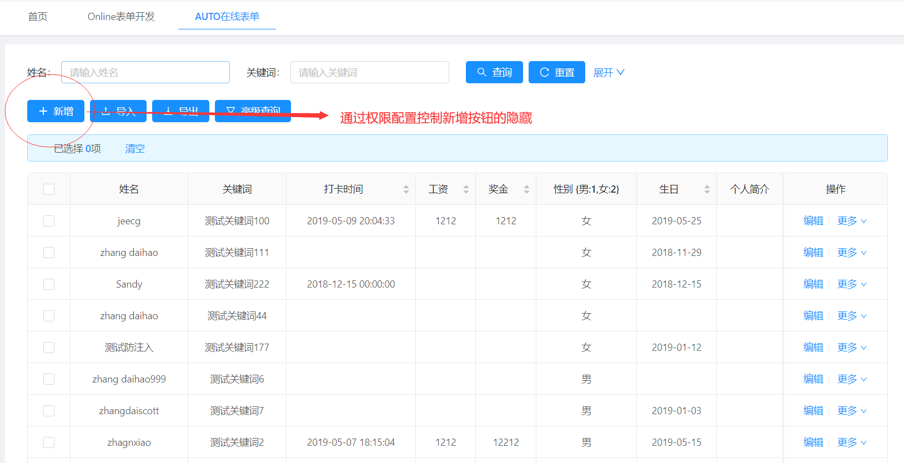
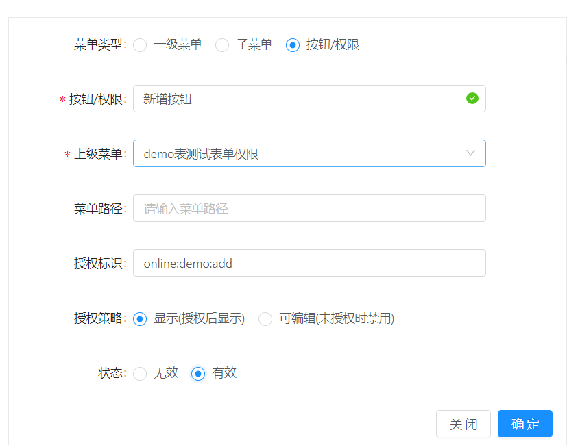
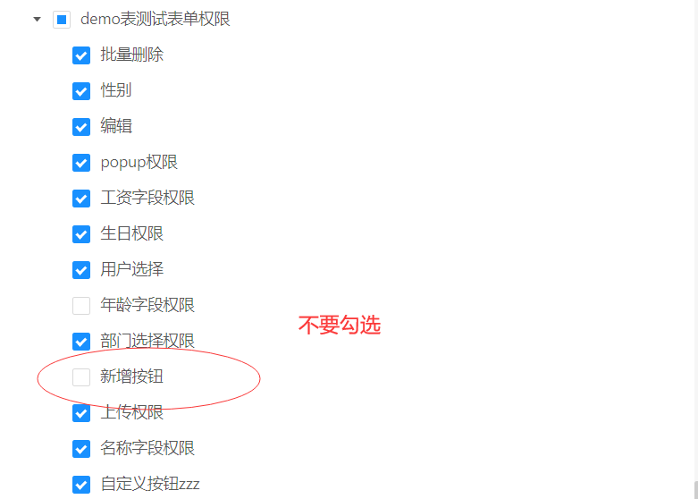
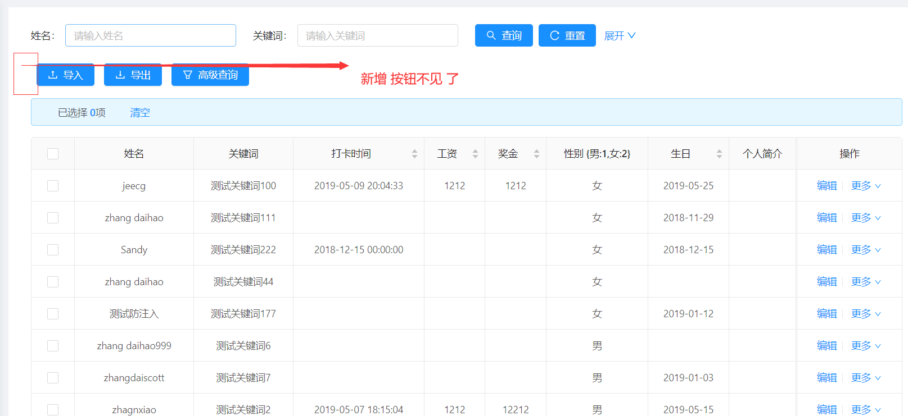

```
授权标识 = online:表名:按钮编码
```
*   控制online列表页面新增/编辑 等按钮权限，每个按钮对应一个唯一的编码。

| 按钮名称 | 按钮编码 | 权限授权标识 |
| --- | --- | --- |
| 新增 | add | online:{表名}:add |
| 编辑 | update | online:{表名}:update |
| 删除 | delete | online:{表名}:delete |
| 批量删除 | batch\_delete | online:{表名}:batch\_delete |
| 导入 | import | online:{表名}:import |
| 导出 | export | online:{表名}:export |
> 以online的demo表为例，控制demo列表的新增按钮的隐藏。
1.进入online的demo表的信息维护界面

2.进入菜单管理界面，（如若没有）新增权限菜单【demo表测试表单权限】

3.在【demo表测试表单权限】下配置权限菜单

4.角色授权

5.再次进入online的demo表的信息维护界面，查看数据列显示如下：



