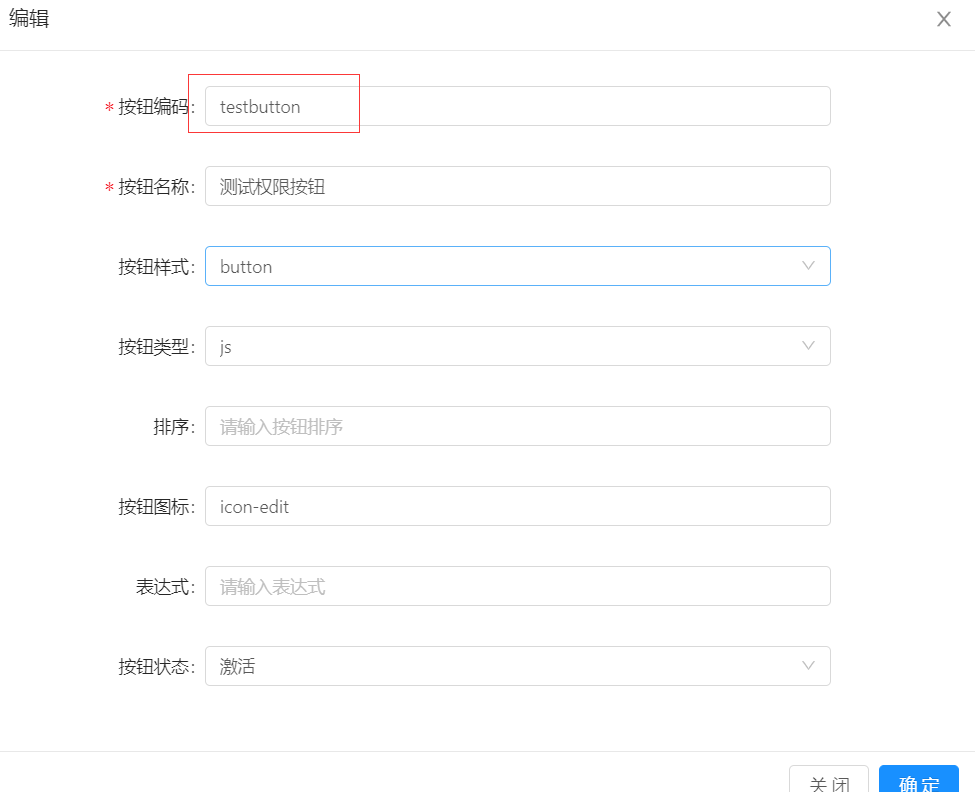
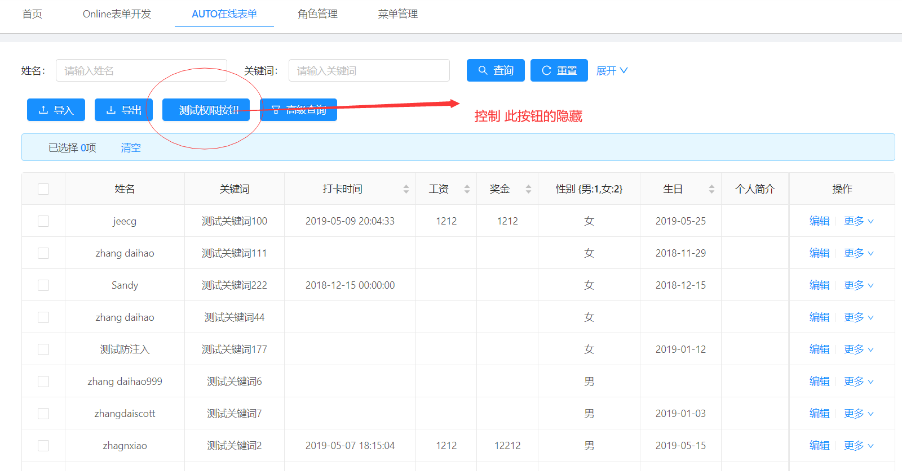
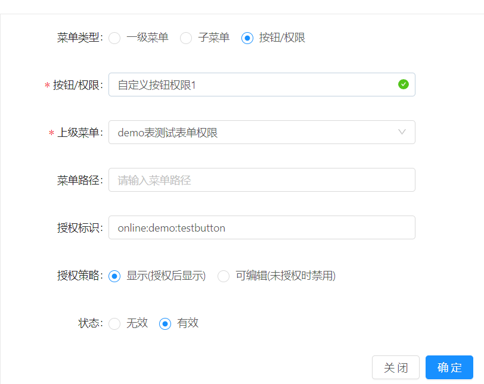
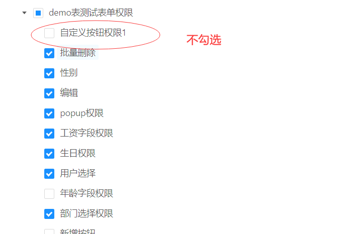
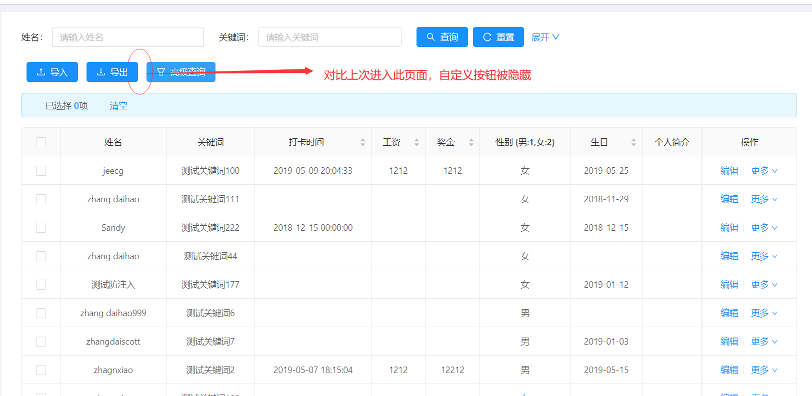

```
授权标识 = online:表名:按钮编码
```
> 以online的demo表为例，控制demo列表自定义按钮的隐藏。
1.进入菜单online表单开发，选中demo表，点击自定义按钮，创建一个button

2.进入online的demo表的信息维护界面

2.进入菜单管理界面，（如若没有）新增权限菜单【demo表测试表单权限】

3.在【demo表测试表单权限】下配置权限菜单

4.角色授权

5.再次进入online的demo表的信息维护界面，查看数据列显示如下：


