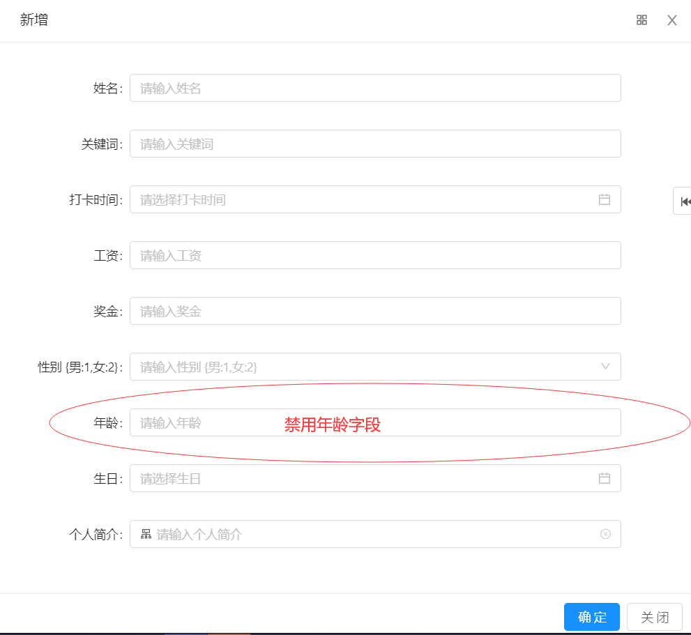
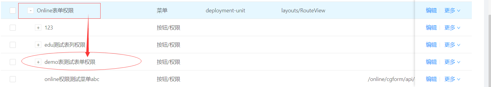
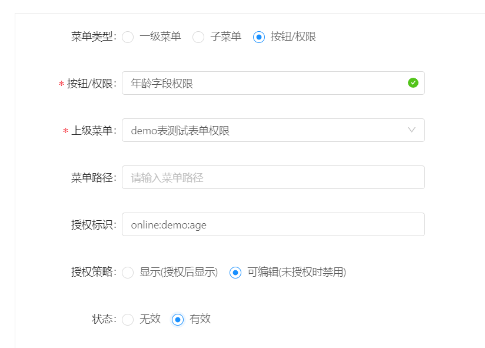
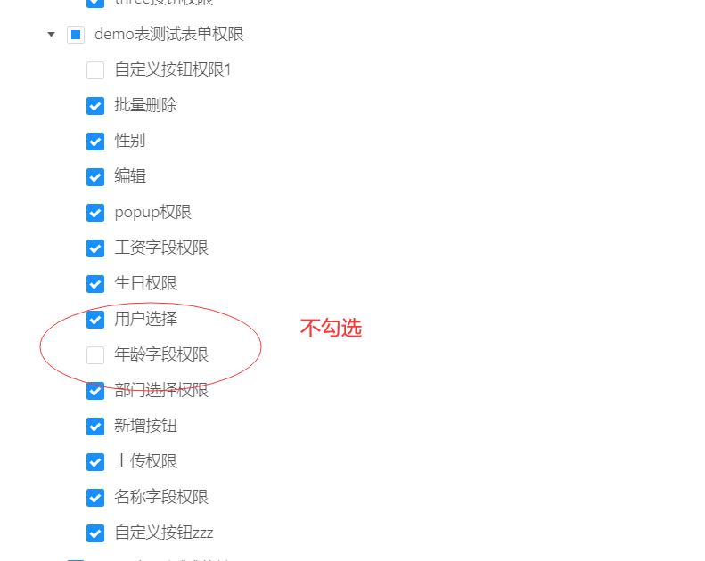
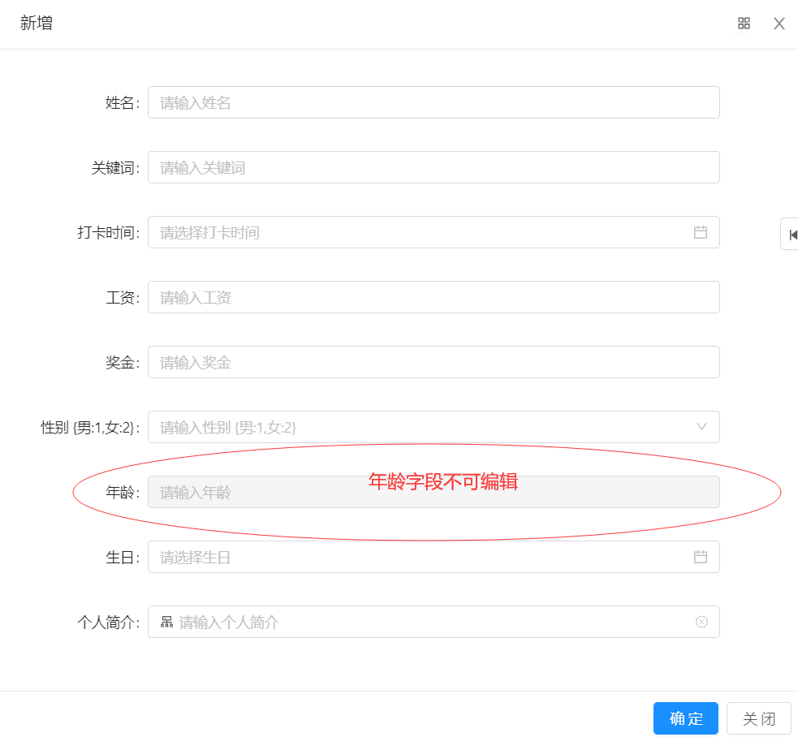

```
   授权标识  =  online:表名:字段名
```

> 以online的demo表为例，禁用demo表的表单页面字段{年龄}。
1.进入online的demo表的信息维护界面，打开表单页面

2.进入菜单管理界面，（如若没有）新增权限菜单【demo表测试表单权限】

3.在【demo表测试表单权限】下配置权限菜单

4. 进入角色管理，进行角色授权

5.再次进入online的demo表的信息维护界面，打开表单页面
