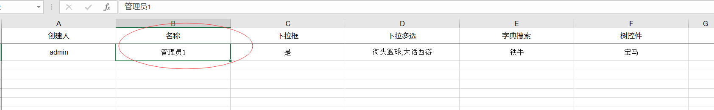

Online导入导出转换器配置

` 新增时间：20200226`
> 目前仅用于online数据的导入导出

配置步骤：
进入online表单配置页面
页面属性 --> 自定义转换器-->在需要的字段上配置转换器即可


配置说明：

1.可以配置Java bean
2.可以配置类路径
3.必须实现FieldCommentConverter接口
4.converterToVal 将文本转化成实际存储的值
5.converterToTxt将存储的值转化成文本
6.getConfig可以直接return null,后续有需求扩展再行说明。

----------------------------
java bean 示例代码：
```
~~~
import org.springframework.stereotype.Component;
import java.util.Map;

@Component("customDemoConverter")
public class CustomDemoConverter implements FieldCommentConverter {

    @Override
    public String converterToVal(String txt) {
        if(txt!=null && txt.equals("管理员1")){
            return "admin";
        }else{
            return txt;
        }
    }

    @Override
    public String converterToTxt(String val) {
        if(val!=null){
            if(val.equals("admin"))
            return "管理员1";

            if(val.equals("scott"))
            return "管理员2";
        }
        return val;
    }

    @Override
    public Map<String, String> getConfig() {
        return null;
    }
}

~~~
```
-------------------------------
功能测试一：导入时，将名称为 管理员1的转化成admin

1.准备excel数据

2.导入后查询列表数据


-------------------------------------
功能测试二：导出时，将 admin的转化成管理员1，将 scott的转化成管理员2
1.查询列表数据

2.导出后 查看excel数据：
**


