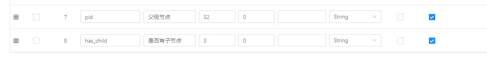

## Online表单树型表单配置

### 树表类型表单
表单创建，基础配置如下：
* 1.设置表单类型为：单表; 
* 2.是否树选择：是; 
* 3.设置特殊字段：【树形表单父id】【树开表单列】

***注意：新版中`has_child`不支持动态配置，即"是否树"由"否"切换成"是"时，会自动添加该字段，但是不支持修改且不能修改，用户忽略即可，而父ID和展示文本列的字段支持自定义。***

### 效果如下

### 其他说明：
* a. 默认字段 pid,has_child 在设置是否树表单时候，会自动追加无需手工添加字段

