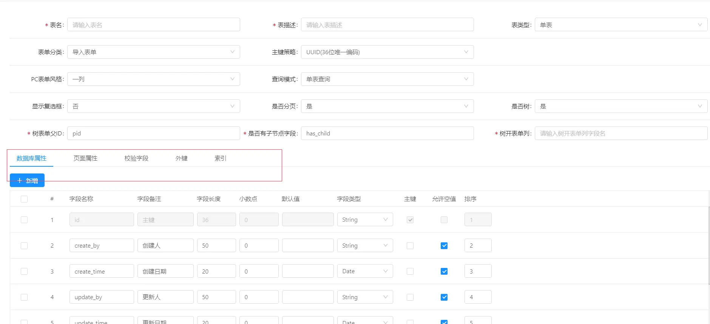

Online表单配置参数说明
===

# Online表单配置
Online 表单支持：单表模型、一对多模型、一对一模型、树模型。
## 一、表单参数介绍
### 1.主参数说明

| 配置| 配置说明| 
| --------   | -----  | ----  |
| 表名| 数据库表名| 
| 表描述| 数据库表描述| 
| 表类型| 表的模型，分单表、一对多、树| 
| 表单分类| 区分表种类的（不重要）| 
| 主键策略| 主键策略：UUID/NATIVE(自增)/SEQUENCE（适合oracle）此处暂时统一使用UUID| 
| PC表单风格| PC端，表单添加页面和修改页面的风格 分为1/2/3/4列展示| 
| 查询模式| 暂时系统内置为多字段查询| 
| 显示复选框| 生成的表单数据列表，是否带着checkbox 系统内置为是| 
| 是否分页| 生成的表单数据列表，是否分页展示 系统内置为是| 
| 是否树:| 控制表单类型，树类型表单需要选择是| 
| 树形表单父id| 树类型表单，用于控制上下级父子关系字段| 
| 是否有子节点字段| 树类型表单，用于控制树节点是否能展开| 
| 树开表单列| 树类型表单，列表页面用于折叠展示的字段| 

### 2.TAB明细页功能说明

| 序号 | 名称 | 功能说明| 
| --------   | ---------------  | ----  |
| 1 | 数据库属性 | 对应数据库表字段的配置| 
| 2 | 页面属性 | 1.对应表单字段展示控件效果，可定义控件类型，控件长度(针对一对多子表作用较大，可自定义设置长度，适应行编辑页面效果);  2. 查询条件配置;  3. 控制字段是否显示;  4. 表单字段支持各种控件| 
| 3 | 校验字段 | 1. 用于设置表单字段对应的字典：比如性别男女，popup对应的报表；2.设置字段的校验规则： 手机号，邮箱等等3.设置列表字段，弹出页面链接| 
| 4 | 外键 | 外键设置，目前外键关系是在附表中设置| 
| 5 | 索引 | 对应数据库表索引，支持单字段索引，多字段索引索引类型: 普通索引\唯一索引| 
详细说明:
- 页面属性的字段控件支持：text/password/select/radio/checkbox/date/datetime/file/textarea/UE编辑器/popup等

