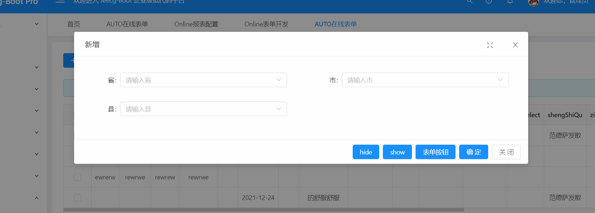
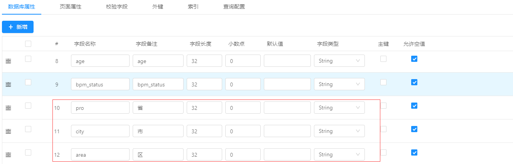

# Online表单 JS增强实现下拉联动
> 
> 需求 ：online表单使用JS增强实现省市区下拉联动

[TOC]

## 示例效果


## 配置步骤：
### ~~1. 新建字典(2021-3月之后版本可忽略此步骤)~~

~~新建一个空的数据字典，字典项名称为空，数据值打个空格就可以录入了~~
>[info] 2021-3月之后版本可忽略此步骤


### 2. online表单添加字段
在online表单中新增3个字段，pro，city，area
详细配置如下， 必须配置`下拉框`，且字典code一定要写

>[info]  `2021-3月之后版本可忽略字典code配置,页面属性下拉框一定要配置`




### 3.编写js增强

代码示例：
```
//示例中数据写死，实际需要自己写请求，
loaded(){
    that.changeOptions('pro',[
	  {value:'1',text:'安徽省'},
	  {value:'2',text:'河南省'}
     ])
}

onlChange(){
  return {
    pro(){
      let value = event.value
      let cityOptions = []
      if(value=='2'){
      	cityOptions = [{text:'郑州市',value:'2-1'},{text:'开封市',value:'2-2'}]
      }else{
      	cityOptions = [{text:'合肥市',value:'1-1'},{text:'芜湖市',value:'1-2'}]
      }
      that.changeOptions('city',cityOptions);
    }
    city(){
      let value = event.value
      let areaOptions = []
      if(value=='1-1'){
      	areaOptions= [{text:'包河区',value:'1-1-1'},{text:'临江县',value:'1-1-2'}]
      }else{
      	areaOptions= [{text:'其他区',value:'xxx'},{text:'其他县',value:'xxxxx'}]
      }
      that.changeOptions('area',areaOptions);
    }
  }
}
```


