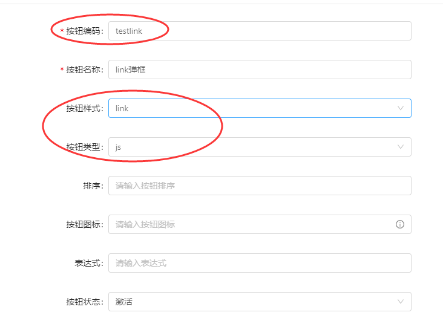
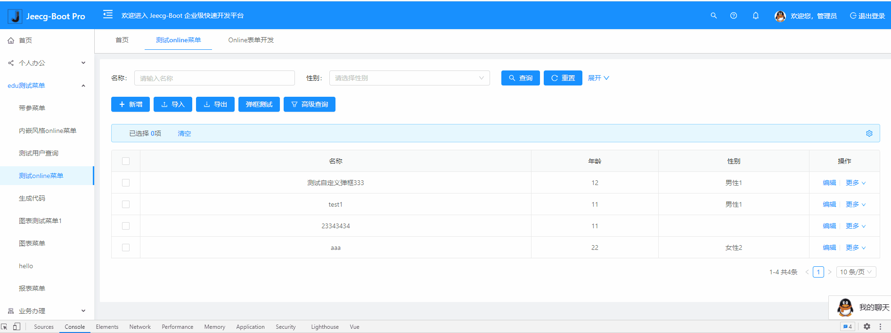
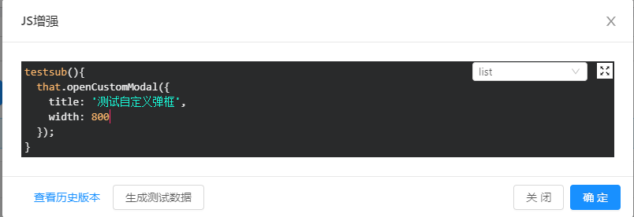

#### **自定义按钮+js增强实现自定义弹框**

>[info] version` 2.4.6+`  20210601  【开源版暂时用不了此功能】

*弹框内容表单支持，`默认表单页面`或者`自定义开发页面`，具体示例见下*

需求：增加自定义按钮，点击按钮支持弹框
实现步骤：
1、添加按钮：按钮样式[button]，按钮类型[js]


2、添加 list页面的js增强

```
test(){
	that.openCustomModal({
        title: '测试自定义弹框',
        width: 800
      });
}
```
此处方法名`test`对应的自定义`button的编码`
3、测试效果：


-------------------------------
**说明文档：**
- 支持按钮 ：按钮样式[button]+按钮类型[js] 或者 按钮样式[link]+按钮类型[js]
- js增强弹框方法：`that.openCustomModal`，方法参数如下表

|  参数名 |   类型|   描述  |
| --- | --- | --- |
|  title   |string |   弹框标题，默认 '自定义弹框'  |
|  width|   int|  弹框宽度，默认600  |
|  row |  object|  操作的数据，如果是button按钮，不设置则默认为当前选中行的数据，如果是link按钮，需要传入函数自带参数row  |
|  **formComponent**|  string |   **自定义弹框内表单组件地址**，设置的格式和系统菜单组件值的配置一样，如果没有设置，则弹框默认打开的是当前表单 |
|  requestUrl|   string | 表单提交地址，如不设置，则默认表单提交地址为原online编辑地址，formComponent未设置时生效  |
|  hide|array|  隐藏的表单控件名， formComponent未设置时生效，可以使原表单的某些控件隐藏  |
|  show|array|  显示的表单控件名， formComponent未设置时生效 ，如果设置，hide参数失效(show与hide互斥)，且只有该数组内的控件才会显示 |


-----
#### 示例1. 按钮样式[link]+按钮类型[js]打开原表单且隐藏某些控件
- 添加按钮

- 添加js
```
testlink(row){
  that.openCustomModal({
    row: row,
    title: '测试自定义弹框2',
    width: 800,
    hide: ['age', 'sex']
  });
}
```
- 演示：


-------

#### 示例2. 按钮样式[button]+按钮类型[js]打开新的自定义表单
- 添加按钮同上
- 添加js
```
test(){
  that.openCustomModal({
    formComponent: 'edu/Hello',
    title: '测试自定义弹框',
    width: 800
  });
}
```
- 演示


**备注：**
上述formComponent用到一个自定义的表单页Hello.vue 
文件地址：`src/views/edu/Hello.vue`
文件内容：
```
<template>
 <div>
   <a-form-model>
     <a-form-model-item label="名称">
       <a-input placeholder="请输入名称" v-model="name"/>
     </a-form-model-item>
   </a-form-model>
 </div>
</template>

<script>
  import { putAction } from '@api/manage'
  export default {
    name: 'Hello',
    data(){
      return {
        name: '',
      }
    },
    props:{
      // 行数据
      row: {
        type: Object,
        default: ()=>{},
        required: false
      },
      // 该地址是online默认的编辑提交地址 如不满足要求需自定义
      url: {
        type: String,
        default: '',
        required: false
      }
    },
    created() {
      this.name = this.row.name
    },
    methods:{
      handleSubmit(){
        let obj = Object.assign({},  this.row,{name: this.name})
        putAction(this.url, obj).then(res=>{
          if(res.success){
            this.$emit('close')
          }else{
            this.$message.warning(res.message)
          }
        })

      }
    }
  }
</script>

```
----

#### 示例3.  erp风格表单 附表配置 按钮样式[button]+按钮类型[js] 打开自定义弹框
- 选中附表，添加自定义按钮，按钮编码testsub，其余操作同上
- 选中附表，点击js增强，切到list，添加js，同上

- 演示：


