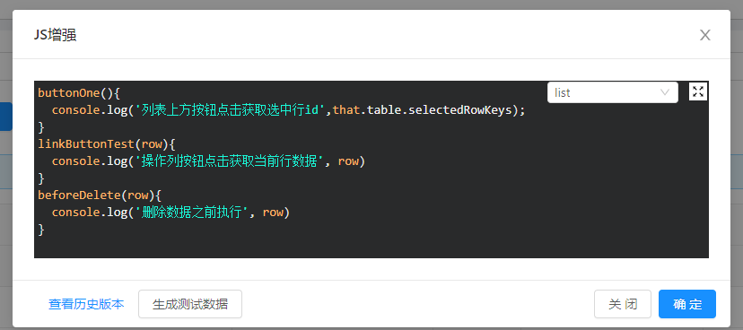
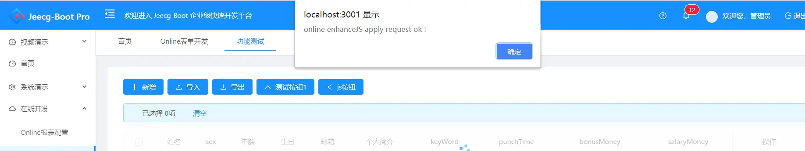
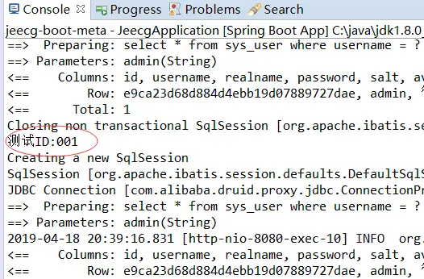

online 基础篇-JS增强
===
*所谓JS增强，即通过在线编写JS脚本实现表单动态效果。
通过按钮触发事件、或绑定内置钩子函数，或监听表单字段改变事件来触发JS代码。*

>[info] JS增强是在线开发概念，不支持代码生成器生成。

### 配置步骤
1.  选中一张online表单，点击列表上方 `JS增强` 按钮

2. 录入自定义的js代码，选择类型 `form(表单)`/`list(列表)` 点击确定保存

```
buttonOne(){
  console.log('列表上方按钮点击获取选中行id',that.table.selectedRowKeys);
}
linkButtonTest(row){
  console.log('操作列按钮点击获取当前行数据', row)
}
beforeDelete(row){
  console.log('删除数据之前执行', row)
}
```

### 配置说明：
- js增强方法定义：不要使用function test(){}的形式 ,一律使用funname(){}的形式
- 如果方法需要绑定`自定义按钮`，请先创建`自定义按钮`
- js增强方法名规范：方法名唯一,需要和自定义按钮的buttonCode保持一致，如上述代码`buttonOne`，`linkButtonTest`,或者遵循内置方法名（如下列表 ）

列表JS增强方法名 | 描述 | 
---|---|
beforeAdd | 在新增之前调用,后续扩展after方法 | 
beforeEdit | 在编辑之前调用,该方法可以携带一个参数row，表示当前记录，后续扩展after方法 | 
beforeDelete | 在删除之前调用,该方法可以携带一个参数row，表示当前记录,后续扩展after方法 | 
created | 在对应页面vue钩子函数created中调用 | 

表单JS增强方法名 | 描述 | 
---|---|
|   loaded  |   表单数据加载完成后触发 （支持获取表单数据）  |
|   beforeSubmit  |   表单数据提交之前 [详细文档](http://doc.jeecg.com/2061290)  |

- js增强关键字：在任意方法内，可使用that关键字,该关键字指向当前页面的vue实例,那就意味着可以用that调用任何当前页面的实例方法/属性,如加载数据that.loadData(),获取查询对象that.queryParam或是that.getQueryParams()等等。
- js增强中发起后台请求： 和前端开发保持一致,使用`postAction`,`getAction`,`deleteAction`(参考下例)

备注：
什么情况下定义的js增强方法会携带参数row？js增强最终还是挂载在按钮上或是挂在vue钩子函数中，我们列表按钮按按钮样式划分有两种,一种在列表上方，一种在列表操作列下，在操作列下的按钮，其对应的方法都会携带一个参数row,指向当前行记录，如上述示例linkButtonTest方法。

### 示例（**js增强中发起后台请求**）
- 1.后台定义请求方法  

- 2.定义js增强（此处是直接在created中发起了一个请求）  

- 3.进入页面测试效果如下：  

后台也接收到参数  


