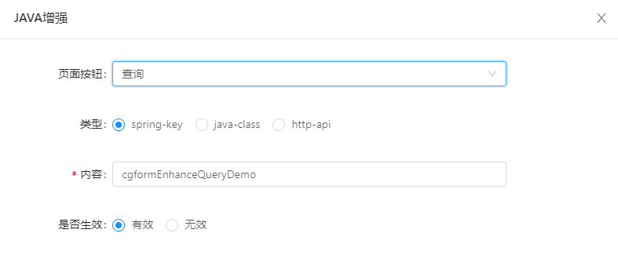
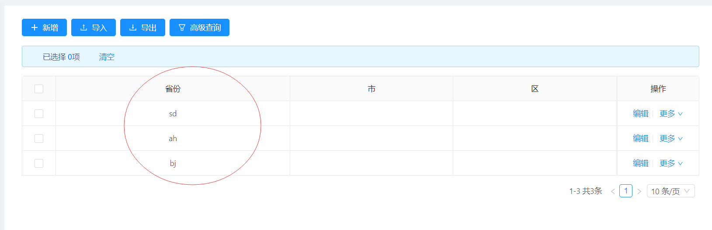

### 功能描述：
> online列表查询数据 可以通过配置 java增强 修改最终需要展示的数据
### 定义java类：
~~~
import org.jeecg.modules.online.cgform.enhance.CgformEnhanceJavaListInter;
import org.jeecg.modules.online.config.exception.BusinessException;
import org.springframework.stereotype.Component;
import java.util.ArrayList;
import java.util.List;
import java.util.Map;

@Component("cgformEnhanceQueryDemo")
public class CgformEnhanceQueryDemo implements CgformEnhanceJavaListInter {

   @Override
   public void execute(String tableName, List<Map<String, Object>> data) throws BusinessException {
      List<VirtualDict> dict = virtualDictData();
      for (Map<String, Object> map : data) {
         Object db = map.get("province");
         if(db==null){
            continue;
         }
         String text = dict.stream()
               .filter(p -> db.toString().equals(p.getValue()))
               .map(VirtualDict::getText)
               .findAny()
               .orElse("");
         map.put("province",text);
      }
   }

   /**
    * 模拟字典数据
    * @return
    */
   private List<VirtualDict> virtualDictData(){
      List<VirtualDict> dict = new ArrayList<VirtualDict>();
      dict.add(new VirtualDict("bj","北京"));
      dict.add(new VirtualDict("sd","山东"));
      dict.add(new VirtualDict("ah","安徽"));
      return dict;
   }

   class VirtualDict {
      String value;
      String text;

      public VirtualDict(String value,String text){
         this.value = value;
         this.text = text;
      }

      public String getValue(){
         return value;
      }

      public String getText(){
         return text;
      }
   }
}

~~~
>[info]  注：java增强导出，需要实现的接口是：CgformEnhanceJavaListInter与常规的JAVA增强不同。

### 增强配置

### 效果展示：
- 没有配置增强之前，访问online表数据

- 配置增强之后，访问online表数据

----

### 查询增强总结：
- 1.java类实现接口`CgformEnhanceJavaListInter `
- 2.重写方法`execute`

