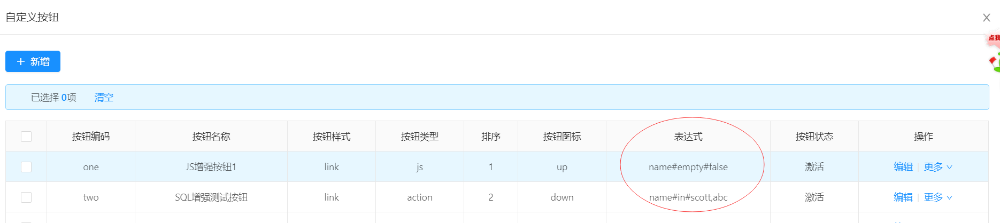

一、link类型的自定义按钮通过配置表达式实现隐藏/显示
1.等于表达式：字段名#eq#值
例如：`name#eq#scott`表示当字段name等于scott的时候才会显示该按钮
2.不等于表达式：字段名#ne#值
3.判断空：字段名#empty#true
4.非空：字段名#empty#false
5.in表达式： 字段名#in#值
例如：`name#in#scott,abc`则当字段name等于scott或者等于abc的时候才会显示该按钮

