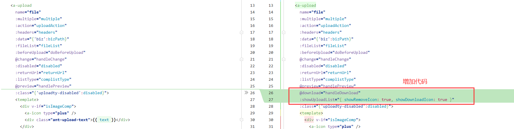
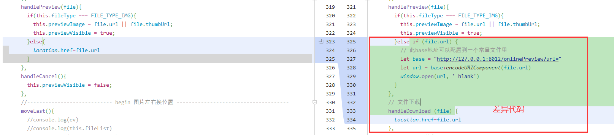

#### 基于`kkfileview:v2`，修改上传组件(JUpload)，支持点击文件预览。

[kkfileview参考文档](https://www.kancloud.cn/zhangdaiscott/jeecg-boot/2043964)
*本示例无官方代码，下方修改仅供参考*
想要实现上述功能，需修改上传组件(JUpload)

- 1.a-upload配置项修改

~~~
@download="handleDownload"
:showUploadList="{ showRemoveIcon: true, showDownloadIcon: true }"
~~~
- 2.新增下载方法，修改预览方法

~~~
handlePreview(file){
  if(this.fileType === FILE_TYPE_IMG){
    this.previewImage = file.url || file.thumbUrl;
    this.previewVisible = true;
  }else if (file.url) {
    // 此base地址可以配置到一个常量文件里
    let base = "http://127.0.0.1:8012/onlinePreview?url="
    let url = base+encodeURIComponent(file.url)
    window.open(url, '_blank')
  }
},
// 文件下载
handleDownload (file) {
  location.href=file.url
},
~~~