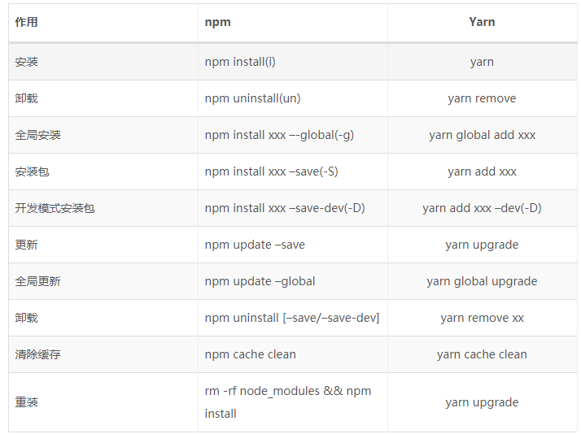

常用命令
===

npm install cnpm -g --registry=https://registry.npm.taobao.org  | cnpm安装
yarn install   |   下载依赖(推荐)
cnpm install   |   下载依赖
npm install   |   下载依赖(不建议用，容易出各种诡异问题&慢)
rimraf node_modules | 删除依赖(需要npm install rimraf -g)

## npm与yarn常用命令对比（npm不稳定建议用yarn或者cnpm）

