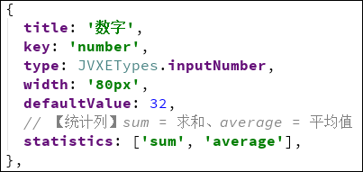
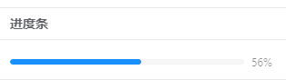

# JVxeTable 组件配置文档

[TOC=2,2]

``` js
import { JVXETypes } from '@/components/jeecg/JVxeTable'
```

>[info] 注：所有的组件参数配置都继承`columns 参数配置`，有特别标注参数的组件都是专属于该组件的属性。

## 普通文本
不显示任何组件，只显示普通文本
* `类型`：`JVXETypes.normal`

## 单行文本
* `类型`：`JVXETypes.input`

## 多行文本
* `类型`：`JVXETypes.textarea`

## 数字输入框
* `类型`：`JVXETypes.inputNumber `
* `参数`：
    - `statistics`：array，统计列配置，设置了之后会自动统计当前列的所有数据并显示在底部
        - sum 求和
        - average 平均值

### 统计列配置示例

 

## 复选框（开关）
* `类型`：`JVXETypes.checkbox`
* `参数`：
    - `defaultChecked`：boolean，默认值是否选中
    - `customValue`：array，自定义值，checkbox需要的是boolean值。
如果数据是其他值（例如`'Y' or 'N'`）时，就会导致错误，所以提供了该属性进行转换。
例：`customValue: ['Y','N']`，会将`true`转换为`'Y'`，`false`转换为`'N'`，反之亦然

## 单选框
* `类型`：`JVXETypes.radio`
* `参数`：
    - `options`：array，选项
    注意：如果选项过多超出了列的宽度，将有可能被截取，
    所以建议不要使用太多的选项，或使用下拉框组件替代。
    - `allowClear` boolean，默认false，是否可以清除选择。
    如果设为true的话，那么点击已被选中的选项时会取消选中。

## 下拉框
* `类型`：`JVXETypes.select`
* `参数`：
    - `options`：**【必填】** array，下拉选项列表，详见下表
    - `allowInput`：是否允许用户输入内容，并创建新的内容
    - `allowSearch`：是否允许用户搜索内容（仅搜索，不创建）
    - `dictCode`：数据字典Code，若options也有值，则拼接在options后面

>[info]  注意事项
    1.  `allowInput`和`allowSearch`不能同时使用，若同时使用，则`allowSearch`的优先级更高
    2.  若`options`的某一项设置了`disabled:true`，则搜索不到该项

### options 所需参数

| 参数 | 类型 | 必填 | 说明 |
| --- | --- | --- | --- |
| text | string | ✔️ | 显示标题 |
| value | string | ✔️ | 真实值 |
| disabled | boolean | | 是否禁用当前选项 |
| ~~title~~ | ~~string~~ |  | ~~显示标题~~（已废弃，若同时填写了 title 和 text 那么优先使用 text） |

## 下拉多选框
* `类型`：`JVXETypes.selectMultiple`
* `参数`：继承`下拉框`的所有参数

## 下拉搜索框
* `类型`：`JVXETypes.selectSearch`
* `参数`：继承`下拉框`的所有参数
    只不过是自动将`allowSearch`参数设为true了，相当于一个语法糖

## 下拉字典搜索框
* `类型`：`JVXETypes.selectDictSearch`
* `参数`：
    - `async`：是否异步搜索
    - `dict`：仅async=true时生效，字典code（数据库表名,显示字段名,存储字段名）
    示例：`"sys_user,realname,username"`
    - `options`：仅async=false时生效，搜索选项
    - `tipsContent`：提示内容，默认：请输入搜索内容

## 日期
* `类型`：`JVXETypes.date`
* `参数`：
    - `format`：格式化显示，默认值：`YYYY-MM-DD`

## 日期时间
* `类型`：`JVXETypes.datetime`
* `参数`：
    - `format`：格式化显示，默认值：`YYYY-MM-DD HH:mm:ss`

## 进度条
给什么值就显示什么进度，最小值0，最大值100
* `类型`：`JVXETypes.progress`


## 文件上传（单个）
* `类型`：`JVXETypes.upload`
* `参数`：
    - `action`：**【必填】** 上传文件路径
    - `token `：boolean，默认false，上传的时候是否传递token
    - `responseName `：*【必填】** 若要从上传成功后从response中取出返回的文件名，那么这里填后台返回的包含文件名的字段名
    - `btnText`：string，默认"点击上传"，按钮的显示文本
    - `allowDownload`：boolean，默认true，是否允许下载
    - `allowRemove`：boolean，默认true，是否允许删除


## 文件上传（批量）
* `类型`：`JVXETypes.file`
* `参数`：继承`文件上传（单个）`的所有参数
    - `action`：非必填，默认`"/sys/common/upload"`
    - `responseName `：非必填，默认`"message"`
    - `btnText`：默认"上传文件"

## 图片上传（批量）
* `类型`：`JVXETypes.image`
* `参数`：继承`文件上传（批量）`的所有参数
    - `btnText`：默认"上传图片"

## Popup
* `类型`：`JVXETypes.popup`
* `参数`：
    - `popupCode`：**【必填】** online报表编码
    - `orgFields`：**【必填】** online报表查询出来的列名，多个以逗号隔开
    - `destFields`：**【必填】** 回填到表单的列名，多个以逗号隔开。如果有多个，则顺序和orgFields一一对应，且数量必须保持一致。
    - `field`：**【必填】** 从destFields中选择一个属性的值返回给当前组件
    - `param`：**Object类型** 动态参数对象，在online报表参数里手动新增记录，然后就可以在自己页面里传递同名参数，作为数据查询条件，如果是字符串类型需要设置成双引号内套单引号的格式 如{name:"'admin'"}
    - `sorter`：默认排序列，使用方法：列名=desc\|asc。例：`age=asc`
        - `v_2.4.5`起开始支持

## 插槽（slot）
* `类型`：`JVXETypes.slot`
* `参数`：
    - `slotName`：**【必填】** slot的名称
    使用方式详见：【使用示例_四】

## 隐藏列
设置了之后该列不会显示出来，但是能正常赋值、取值。
* `类型`：`JVXETypes.hidden`
