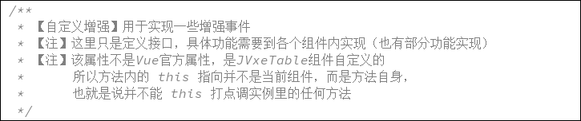
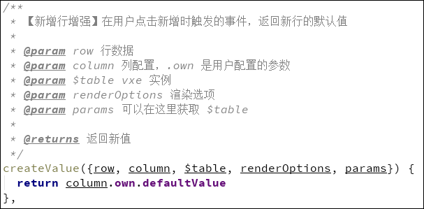

# 自定义组件增强

[TOC=2,9]

这里只介绍几个常用的增强
其他增强详见：`src/components/jeecg/JVxeTable/mixins/JVxeCellMixins.js`

## setValue(value)
向组件内传值时调用的增强。
一般用于特殊处理数据，例如多选下拉组件，需要一个数组，但是用户传递了一个用逗号分割的字符串，导致组件无法正常识别，这时候就可以在该增强了写适配代码了，将字符串split处理成数组，再返回即可。

## getValue(value)
组件向外传值时调用的增强。
当用户通过 `getTableData()`方法获取数据时，对数据做处理。例如多选下拉组件，实际数据是一个数组，但是数据库里保存的是逗号分割的字符串，所以就需要在该方法内处理一下。

## createValue({row, column, $table, renderOptions, params})
参数介绍：

在用户点击新增时触发，返回的值就是新行的默认值，默认行为是返回`defaultValue`字段，可以重写处理。