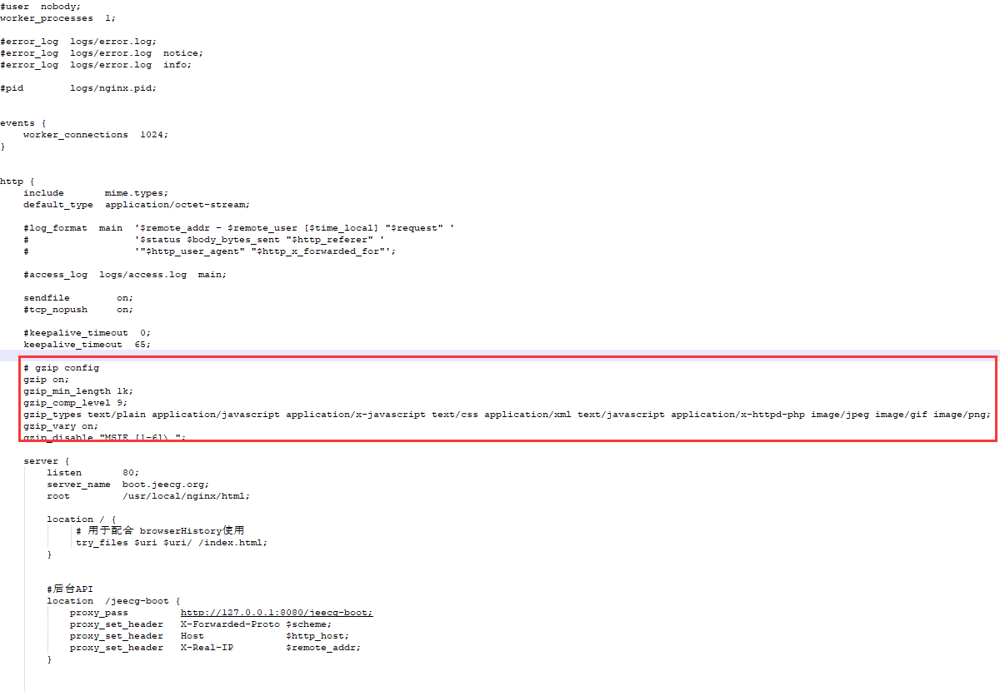

### 开启Nginx压缩，解决前端访问慢问题

nginx.conf 的 http 中加入以下片断

~~~
    # gzip config
    gzip on;
    gzip_min_length 1k;
    gzip_comp_level 9;
    gzip_types text/plain application/javascript application/x-javascript text/css application/xml text/javascript application/x-httpd-php image/jpeg image/gif image/png;
    gzip_vary on;
    gzip_disable "MSIE [1-6]\.";
~~~

参考图：

参考链接： https://github.com/zhangdaiscott/jeecg-boot/issues/88

