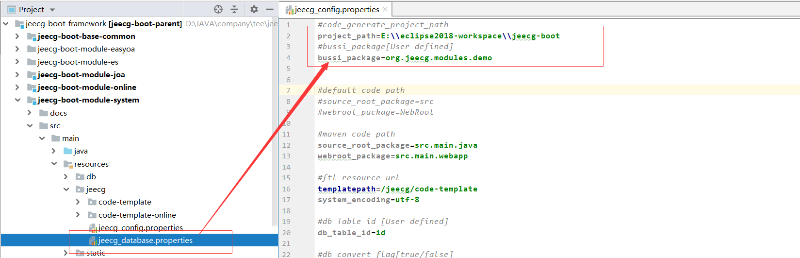
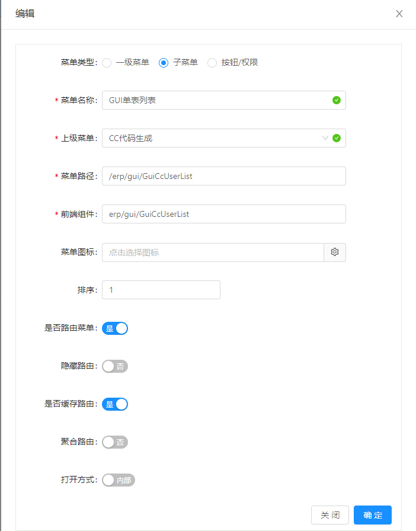

# Online代码生成用法

[TOC]

## 1. 数据库配置
>[info] Version: 2.4.3+，代码生成与平台数据库保持一致，不需要额外配置

需要个性化配置，[请参考此文档](代码生成器配置文件.md)

## 2. 代码生成路径配置
配置文件路径： jeecg-boot-module-system/jeecg/jeecg_config.properties

* 第一个project_path，无所谓，在生成界面，可以自己选择路径
* 第二个bussi_package是生成代码的包路径，根据自己情况修改

## 3. 通过online表单在线建表
> jeecg提供了在线建表的功能，找到菜单： `在线开发 -> Online表单开发`配置完表单，点击同步数据库，会在数据库生成该表。

### 3.1 online表单字段控件配置
> online表单字段的控件类型，支持 下拉、radio、checkbox、选择人、选择部门、popup、下拉搜索、省市县、下拉多选等，已经满足在线低代码开发需求 ， [Online表单专题视频](https://www.bilibili.com/video/BV1zJ411t7FG)

### 3.2 online表单一对多，外键配置注意
~~~
// 子表外键参数配置
/* 说明: 
 * a) 子表引用主表主键ID作为外键，外键字段必须以_ID结尾，例如 ORDER_ID
 * b) 主表和子表的外键字段名字，必须相同（除主键ID外）;
*/
~~~

## 4. 生成代码界面
> 点击online表单上方的代码生成按钮，选中需要生成的表单，就可以调出代码生成的界面

 ### a. 单表界面

 ### b. 一对多界面

一对多的online表代码生成界面，标注的都是可以修改的，正常情况只需要修改包名，其他可以根据自己情况修改
 ### c. 生成代码动图演示

## 5. 生成代码结构
>[info] 如果选择生成代码目录，直可以接选择到生成到那个模块，这样java代码不需要再手工调整，只需要将前端代码复制到前端vue项目中。

JAVA端如下：
](images/screenshot_1587294490406.png)
前端如下：

## 6. 配置菜单
通过菜单管理，新建菜单

动图演示

*  菜单路径： 请求URL
*  前端组件： 前端vue list页面的路径
>  比如： 前端vue页面的实际路径是  `src/views/erp/demo2/CcTouSuList.vue`
>  配置菜单组件路径为: 去掉前缀 `src/views/` 和后缀 `.vue` => `erp/demo2/CcTouSuList`
> 菜单快速SQL，参考 [此链接](http://doc.jeecg.com/2043936)
> 关于菜单详细说明，参考 [此文档](http://doc.jeecg.com/2043933)

## 7. 角色授权

 生成代码后需要重启才生效，通过角色授权菜单，重新登录就可以通过菜单访问生成的代码

