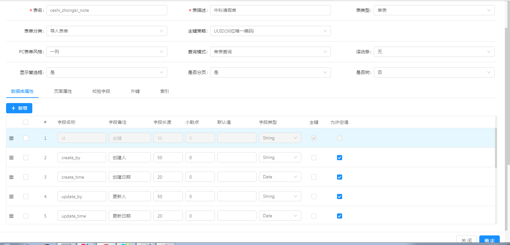
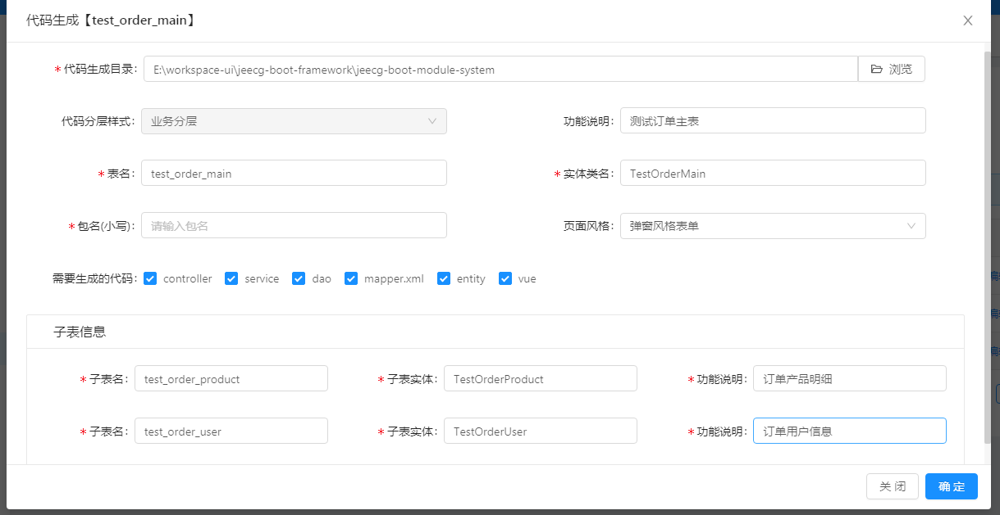

# 代码生成器功能介绍

  JeecgBoot代码生成器非常强大：支持单表、一对多、一对一、树模型生成，生成的代码包括前台（支持vue2和vue3）和后台，生成后直接使用，无需修改！

**特点：**
-  一键生成的代码清单（包括：controller、service、dao、mapper、entity、vue）
- 支持自定义代码生成器模板：采用freeMarker语法模板文件，目录结构与实际目录保持一致，结构非常清晰
- 代码生成器分两种模式： Online在线模式 和 GUI模式
`区别：Online模式比GUI代码生成更强大，支持更多的组件生成，建议用online模式。`

## Online在线代码生成
> 菜单路径： `在线开发->Online表单`
> 在线建表，配置表单控件，所见即所得，支持更多组件
> 比如：字典、下拉搜索组件、Popup组件、上传组件等等）
> 点击视频快速掌握：[https://www.bilibili.com/video/BV1Y541147m1](https://www.bilibili.com/video/BV1Y541147m1)

* 1. 单表代码生成

* 2. 一对多代码生成

