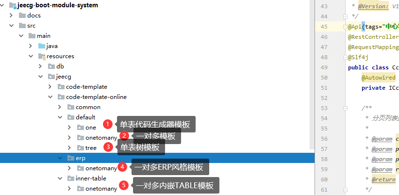
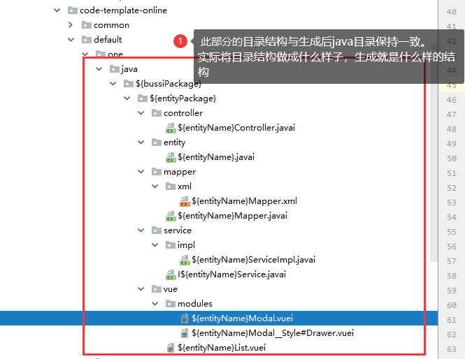
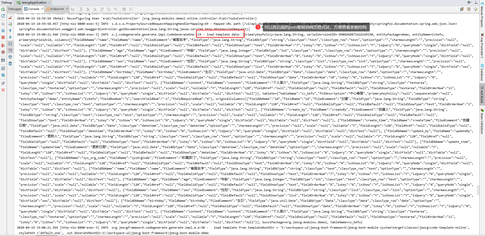

# 如何自定义生成器模板

## 模板介绍
* 代码生成器模板路径

|  类型   |  模板路径   |
| --- | --- |
|   Online代码生成模板  |  jeecg-boot-module-system\src\main\resources\jeecg\code-template-online   |
|  GUI代码生成模板   | jeecg-boot-module-system\src\main\resources\jeecg\code-template   |

* 代码生成器模板介绍

## 模板目录结构和后缀说明
* 模板目录结构说明
  以单表举例：

* 模板文件后缀说明
  模板文件后缀额外加了`i`后缀，为了与java和vue默认的后缀区别
 .java ===> .javai
 .vue ===> .vuei
 .xml ===> .xml (xm无i后缀)
* 模板文件语法采用 [freeMarker](http://freemarker.foofun.cn/)
* 模板文件所用参数，可以参考生成代码输出的Log
  将日志复制到 [网页工具](https://www.sojson.com/) json格式化 ，方便查看
 

*   格式化后

>[warning] 如果需要自定义生成模板或者做个性化修改，修改此处freemarker模块文件（模板的目录结构与生成后的结构保持一致）

 

