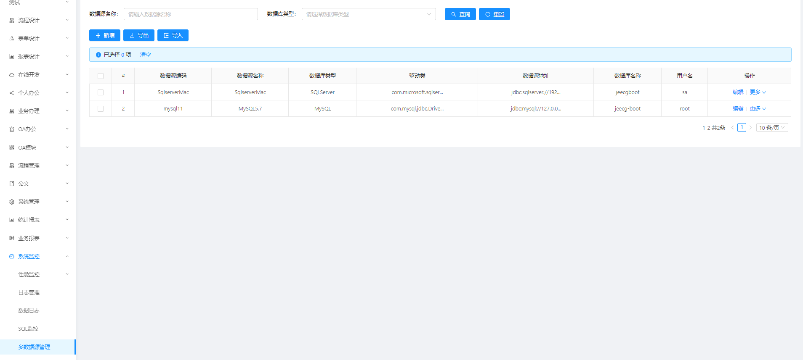
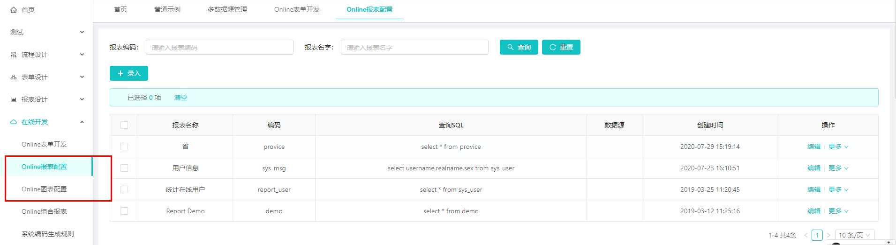

 **怎样配置在线多数据源**
首先打开配置管理页面：系统监控>多数据源管理

1.新增

>[danger]数据源编码是唯一的，并且编码必须以字母开头，可包含数字、下划线、横杠。

填写完信息后可以点测试看是否配置正确，如下图，弹出测试成功即配置正确

2.编辑
如信息填写有错误，可以点编辑修改，注意数据源编码是不可能更改的

同理，Oracle和SQLServer数据库配置方法一样，只要选择对应的数据库类型，填写上连接的账号密码即可

注意：
若回显的驱动类和数据源地址与你的数据库版本不一致，可自行修改。**例如：**
### Mysql5.x与Mysql8.0.X的几点不同
***Mysql5.x***
驱动类：com.mysql.jdbc.Driver
数据源地址：jdbc:mysql://127.0.0.1:3306/jeecg-boot?characterEncoding=utf-8&useSSL=false
***Mysql8.0.X：***
驱动类：com.mysql.cj.jdbc.Driver
数据源地址：jdbc:mysql://127.0.0.1:3306/jeecg-boot?useUnicode=true&characterEncoding=UTF8&useSSL=false&allowPublicKeyRetrieval=true&serverTimezone=UTC

3.测试
在线开发>online报表配置

编辑：配置数据源

点击 ‘功能测试’

出现下图一直加载或者查询失败，则数据源配置有误

出现如下图，则数据源配置正确

  

