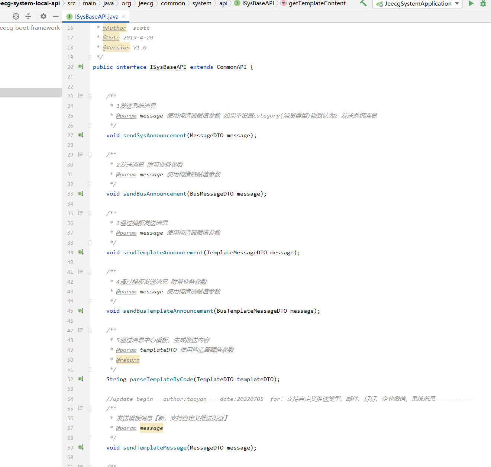

# 平台消息推送接口

[TOC]

## 1、短信通知接口

`DySmsHelper.sendSms(mobile, obj,DySmsEnum.REGISTER_TEMPLATE_CODE)`

##  2、邮件通知接口

~~~
JavaMailSender mailSender = (JavaMailSender) SpringContextUtils.getBean("mailSender");
SimpleMailMessage message = new SimpleMailMessage();
// 设置发送方邮箱地址
message.setFrom(emailFrom);
message.setTo(es_receiver);
message.setSubject(es_title);
message.setText(es_content);
mailSender.send(message);
~~~

##  3、系统消息提醒

~~~
sysBaseAPI.sendSysAnnouncement(formUsername, toUsername, "同步用户到工作流引擎完成", "同步用户到工作流引擎完成");
~~~

##  4、系统消息提醒（调用消息中心的模板）
> 通过设计模板，可以自定义格式，支持发送邮件和系统消息。

 ### 4.1 在线设计消息模板
     菜单： 消息中心 -> 模板管理
   
 ### 4.2 调用ISysBaseAPI接口发送系统消息
~~~
/**
 * 发送系统消息
 * @param fromUser 发送人(用户登录账户)
 * @param toUser   发送给(用户登录账户)
 * @param title    通知标题
 * @param map         模板参数
 * @param templateCode  模板编码
 */
public void sendSysAnnouncement(String fromUser, String toUser,String title, Map<String, String> map, String templateCode);

/**
 * 通过消息中心模板，生成推送内容
 *
 * @param templateCode 模板编码
 * @param map          模板参数
 * @return
 */
public String parseTemplateByCode(String templateCode, Map<String, String> map);
~~~

更多推送接口参考
org/jeecg/common/system/api/ISysBaseAPI.java

