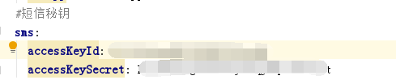
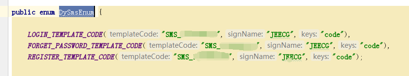

# 短信接口配置文档（阿里大鱼短信）
jeecg-boot 提供了发送短信的接口，配置完成后，可调用相应接口，完成发送短信
[TOC]
## 1. 在yml文件中配置阿里短信秘钥

## 2. 在阿里中配置短信模板，将短信模板添加到DySmsEnum文件中

## 3. 调用短信接口
根据不同操作，使用不同短信模板，调用发送短信接口
~~~
/**
 * smsmode 短信模板方式  0 .登录模板、1.注册模板、2.忘记密码模板
 */
String mobile = "18888888888";
JSONObject obj = new JSONObject();
obj.put("code", "123456");
if (CommonConstant.SMS_TPL_TYPE_0.equals(smsmode)) {
   //登录模板
   b = DySmsHelper.sendSms(mobile, obj, DySmsEnum.LOGIN_TEMPLATE_CODE);
} else if(CommonConstant.SMS_TPL_TYPE_2.equals(smsmode)) {
   //忘记密码模板
   b = DySmsHelper.sendSms(mobile, obj, DySmsEnum.FORGET_PASSWORD_TEMPLATE_CODE);
}
~~~
### 接口上送参数说明
| 名称 | 类型 | 说明
|---|---|----|
|  phone | String | 手机号 |
|  templateParamJson | JSONObject | 短信内容 |
|  dySmsEnum | DySmsEnum | 短信模板 |

