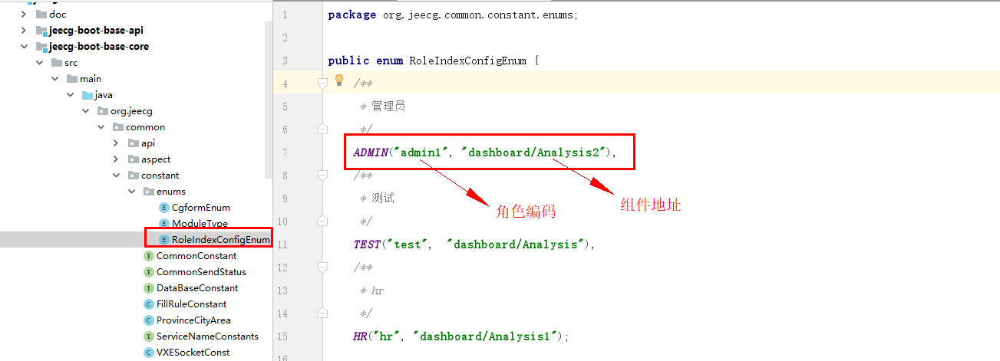

# 自定义首页使用方法
jeecg-boot 提供了自定义首页的枚举，修改枚举即可实现自定义首页
`v2.4.6+`

[TOC]
## 1. 修改枚举
org.jeecg.common.constant.enums.RoleIndexConfigEnum
修改枚举类，配置角色和其对应的首页前端组件地址

## 2.动态配置
如果想动态配置角色和组件地址，可自行扩展与枚举类似的数据结构即可。

例如，新增表来配置角色路由数据。
| 角色编码 | 前端组件地址 |
| --- | --- |
| admin | dashboard/Analysis |
| test | dashboard/Analysis |
***** 
