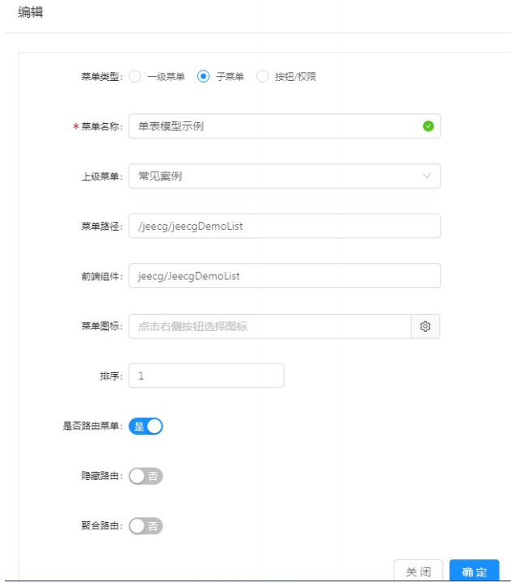
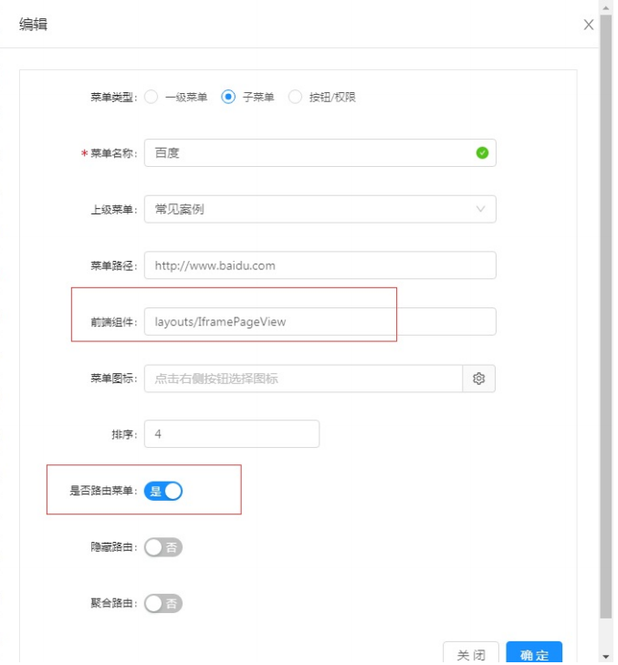

菜单配置说明
===

| 字段名称| 说明|
|---|----|
|   菜单类型   | 一级菜单：配置一级菜单；子菜单：配置下级菜单；按钮：配置页面按钮权限   |
|   菜单名称   |   定义菜单名称  |
|   上级菜单   |   菜单类型为子菜单时，选择关联的上级菜单  |
|   菜单路径   |   定义菜单的路径，通常为：/包名/文件名 具体参见【菜单路径配置说明】 |
|   前端组件   |   定义菜单访问的组件名称，有两种类型，一种为通用组件，一种为具体的页面，
|             |    具体参见【前端组件配置说明】  |
|   菜单图标   |   菜单树展示的图标  |
|   排序       |   菜单展示的先后顺序  |
|   是否路由   |    此处很重要，默认是路由；如果是非的话，访问404 |
|   隐藏路由   |    不展示为菜单，但是在页面中跳转，弹出的页面路由菜单 |
|   聚合路由   |    多个下级菜单路由在一个页面聚合展示 |
|   打开方式   |    内部/外部，外部只非路由请求 |

### 前端组件配置说明：
- 1、非叶子菜单（即没有下级的菜单）配置固定 前端组件layouts/RouteView
- 2、普通的叶子菜单（即具体的页面） 配置相对于src/views目录的路径 
   例如src/views/jeecg/helloworld.vue 这个页面，前端组件为 jeecg/helloworld

- 3、需要跳转到第三页面的菜单 前端组件固定为：layouts/IframePageView，比如跳转百度：https://www.baidu.com

- 4、java后台请求的菜单
   需要以{{ window._CONFIG['domianURL'] }}开头

- 5、配置外网打开的链接
 请求地址需要以http开头或者{{ window._CONFIG['domianURL'] }}开头

### 菜单路径配置说明
- 1、非叶子菜单（即没有下级的菜单），URL配置规则：按照功能模块定义的关键根路径即可，不能重复，需以“/”开头
- 2、普通的叶子菜单（即具体的页面），URL和前端组件配置保持一致即可，需在前端组件值前加“/”
- 3、需要跳转到第三方页面的菜单，菜单路径配置第三方跳转的地址即可，例如http://www.baidu.com

