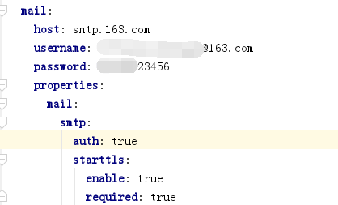

# 邮箱发送配置文档
jeecg-boot 提供了发送邮件的接口，配置完成后，可调用相应接口，完成发送邮件
[TOC]
## 1. 在yml文件中配置邮件信息，host，用户名及密码

## 2. 调用发送邮件接口
调用发送邮件接口
~~~
String es_receiver = "1111@163.com";
String es_title = "jeecg测试邮件";
String es_content = "测试内容"
emailSendMsgHandle.SendMsg(es_receiver ,es_title ,es_content );
~~~
### 发送邮件接口上送参数说明
| 名称 | 类型 | 说明
|---|---|----|
|  es_receiver | String | 接收邮件邮箱 |
|  es_title | String| 邮件标题 |
|  es_content | String| 邮件发送内容 |