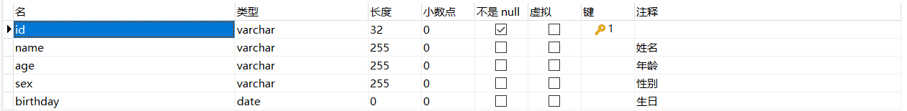
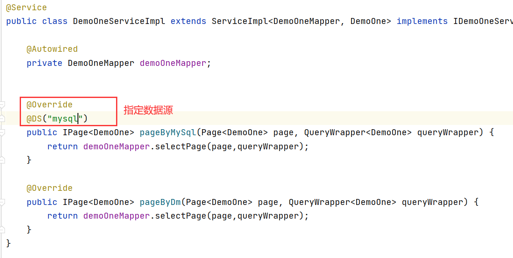

> 如果你想集成达梦数据库，并且项配置多个数据源，那么请参考此文章

[TOC]
## 效果展示


>测试效果，采用postman进行接口访问测试，当是达梦数据库的时候`name`为`张三`，mysql`name`为`李四`
## 准备工作
### 在不同数据库准备同一个表，并有不同的数据
> 字段 包含 name、sex、age、birthday



#### 达梦数据库的数据


#### MYSQL数据库的数据


## 重点来了->多数据源配置

### `appliciton.yml`的配置

> 第一步，要将`filters`去除`wall`


> 第二步创建多个数据源


> 如果是达梦是主数据源还需要修改`jpa`
```
jpa:
  open-in-view: false
  properties:
    hibernate:
      dialect: org.hibernate.dialect.Oracle8iDialect
```


> 如果springboot升级到2.6+，还需要修改quartz 配置
~~~
spring.quartz.jdbc.initialize-schema=never
~~~


> yml数据源配置
```
spring:
  jpa:
    open-in-view: false
    properties:
      hibernate:
        dialect: org.hibernate.dialect.Oracle8iDialect
  datasource:
    druid:
      stat-view-servlet:
        enabled: true
        loginUsername: admin
        loginPassword: 123456
        allow:
      web-stat-filter:
        enabled: true
    #打开多数据源，加上上面的就可以实现多数据源的配置
    dynamic:
      druid:
        filters: stat,slf4j
        # 初始连接数
        initialSize: 5
        validationQuery: SELECT 1 FROM DUAL
        # 最小连接池数量
        minIdle: 5
        # 最大连接池数量
        maxActive: 10
      datasource:
        master:
          url: jdbc:dm://127.0.0.1:JEECGBOOT/?JEECG&zeroDateTimeBehavior=convertToNull&useUnicode=true&characterEncoding=utf-8
          username: ??
          password: ??
          driverClassName: dm.jdbc.driver.DmDriver
          type: com.alibaba.druid.pool.DruidDataSource
        mysql:
          url: jdbc:mysql://127.0.0.1:3306/jeecg-boot?characterEncoding=UTF-8&useUnicode=true&useSSL=false&tinyInt1isBit=false&allowPublicKeyRetrieval=true&serverTimezone=Asia/Shanghai
          username: ??
          password: ??
          driver-class-name: com.mysql.cj.jdbc.Driver
```

### 在实现类中填写注解
```
@DS("mysql")
```
