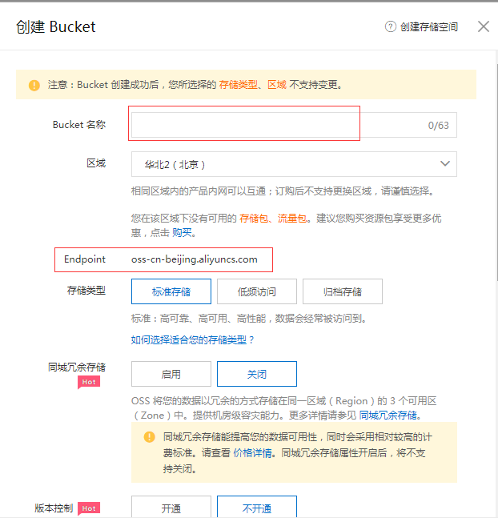

# OSS文件上传配置
jeecg-boot 提供文件及图片上传至阿里云OSS。

[TOC]
## 注册OSS账号
[阿里云账号申请方法](https://blog.csdn.net/legend12300/article/details/51130877)
## 创建桶
创建桶时可设置桶名称、读写方式、Endpoint根据选择区域变化

## 设置访问策略 （重要）
创建桶后进入桶详情中可创建访问策略，授权其他用户访问OSS资源，更多策略设置可查看阿里云文档

也可在代码中设置桶的访问策略
~~~
设置权限(公开读)
ossClient.setBucketAcl(newBucket, CannedAccessControlList.PublicRead);
~~~

## yml文件配置
注册完账号后在yml文件中设置oss访问

参数说明
| 名称 | 说明
|---|-----|
|  endpoint | OSS endpoint 创建桶时根据区域选择的endpoint |
|  accessKey | 阿里云API的密钥 |
|  secretKey | 账号的accessKeySecret |
|  bucketName | 阿里云桶名字  |
| staticDomain | 服务器设置的OSS访问域名，如果没有则默认使用endpoint |
获取方式：登录阿里云账号后，可在用户管理安全信息管理中获得

