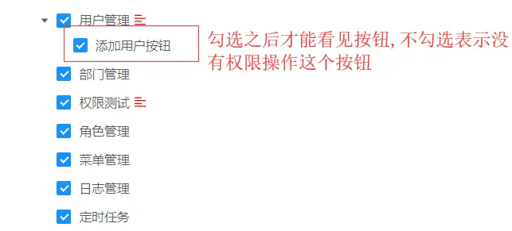

JAVA访问权限控制
===

>[info] [常用权限注解](https://www.cnblogs.com/weibanggang/p/10396100.html)
> 
> @RequiresRoles("admin")   // 控制角色
> @RequiresPermissions("sys:role:update")  // 控制权限指令


1.后台请求权限控制，通过Shiro注解 @RequiresPermissions

```
@RequestMapping(value = "/add", method = RequestMethod.POST)
@RequiresPermissions("user:add")
public Result<SysUser> add(@RequestBody JSONObject jsonObject) {
```

2.后台进入菜单管理页面配置访问权限标识（选择按钮类型）
（配置方式与按钮权限一样，即同一个授权标识，可以同时控制后台请求和前台按钮显示控制）


3.进入角色管理授权访问权限（授权后即可访问该请求）


