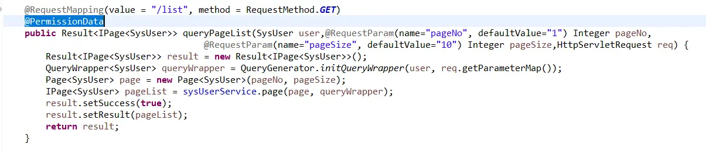
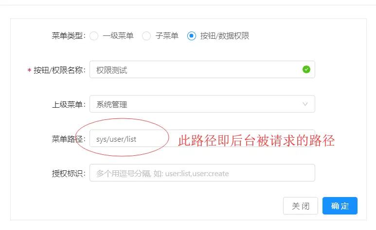
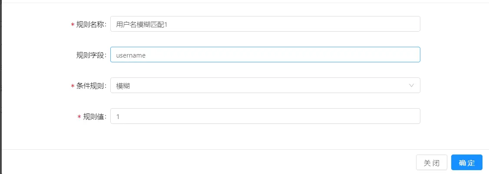
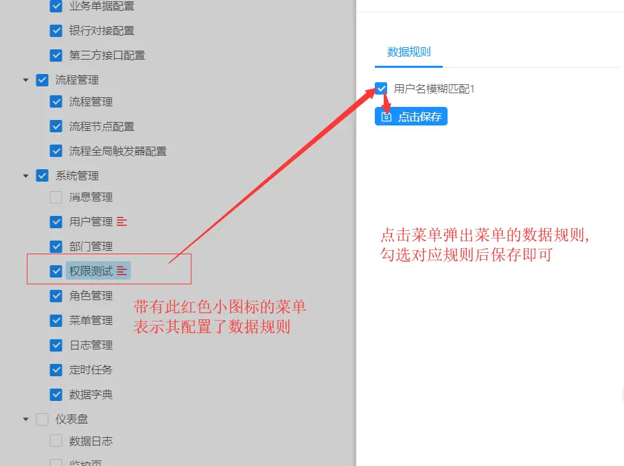

## 方式A（通过请求URL）——不推荐（比较麻烦，不建议用）

> 方式A的问题在于, 针对每个请求都需要配置一个权限菜单,这样其实也很费劲,同时对于菜单管理也不是很好
> 鉴于此可以考虑使用方式B

###  A-1.添加注解 

>  虽然不推荐此方案，但是如果一个菜单要对多个请求进行数据权限控制，则需要用此方式。

  在后台请求方法上加注解  ```@PermissionData``` (如下图)
 设计目的：为了提高系统运行效率,这样就可以指定请求走权限过滤的逻辑,而非一棍子打死,让所有请求都去筛选一下权限


###  A-2.新增二级数据权限菜单

 进入【系统管理】-->【菜单管理】界面 新增一个权限菜单(如下图)


###  A-3.配置数据权限规则
找到步骤2新增的菜单,点击操作列更多中的数据规则,配置,_只查询用户账号带1的用户_(如下图)


###   A-4.角色授权
进入【系统管理】-->【角色管理】界面找到当前用户对应的角色，点击 更多->授权 操作，右侧弹出框中找到步骤2菜单，点击后勾选权限规则,保存(如下图)


###   A-5.测试
 退出重新登录系统，访问用户管理界面发现数据被过滤了,即权限生效!
