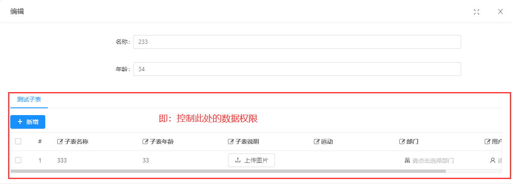
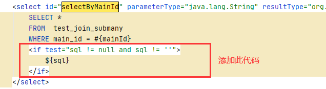

### 一.需求
主子表，**代码生成后**，子表数据可以通过表单查看，现在需要控制子表数据的查看权限。

### 二.操作步骤
#### 1.添加权限菜单：
找到controller中加载子表数据的请求方法，一般是`queryxxxListByMainId`,获取其**请求路径**，添加菜单

只需要填写前四项，其中菜单路径填写**请求路径**
#### 2.添加数据规则
给步骤1新增的菜单添加数据规则：

#### 3.角色授权
进入【系统管理】-->【角色管理】将步骤1、2新增的菜单/数据规则授权给需要的角色。
#### 4.代码修改
- controller，给步骤1中的方法需要添加注解`@PermissionData`
- mapper，修改mapper方法，给方法添加一个参数

- mapper.xml ,修改查询语句，

- serviceImpl， 查询数据前获取权限sql，传入mapper

~~~
String sql = QueryGenerator.installAuthJdbc(xxx.class);
~~~
