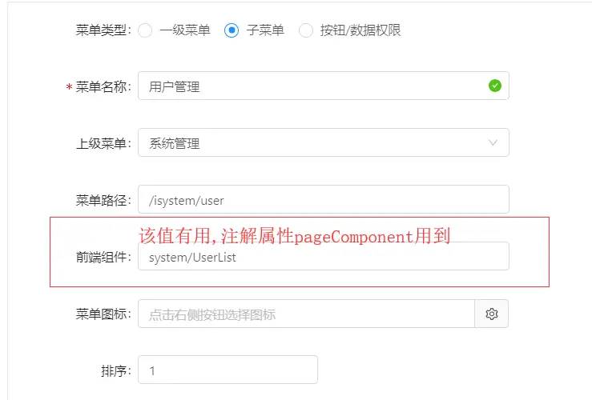
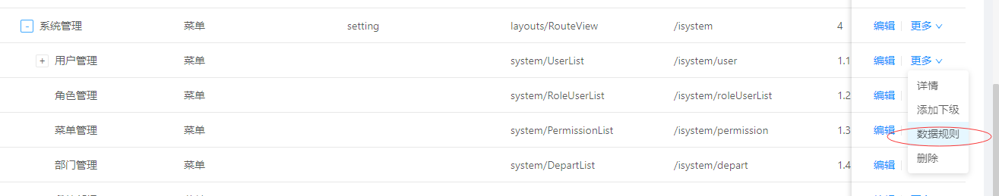
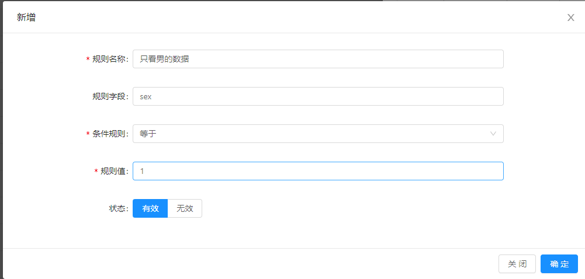

# 数据权限用法(优先方式B)

##  权限介绍

>  数据权限，是通过数据权限控制行数据展示，让不同的人看不同的数据；
> 比如： 销售人员只能看自己的数据；销售经理可以看所有下级销售人员的数据；财务只看金额大于5000的数据等等；

>[info]  示例
> 以用户管理列表为例， 实现只查询用户账号带1的用户
> 数据权限用法分两种， A方式（通过请求URL匹配数据权限）和 B方式（通过前端组件名匹配数据权限），推荐用B方式

## 方式B（通过前端组件名）——官方推荐

基于注解`@PermissionData(pageComponent="system/UserList")`实现具体步骤如下：

### 1. 配置页面菜单

###  2. 给JAVA方法加注解 
  给请求方法添加注解 `@PermissionData(pageComponent="system/UserList")` 参数pageComponent值与菜单的前端组件值保持一致

### 3. 给菜单配置数据权限
找到需要配置权限的页面菜单，这里是用户管理菜单，直接在该菜单上配置数据规则。

数据权限配置（只看性别为男的用户）

 
#### 规则字段配置说明
 <b>规则字段说明</b>
 ` 这里对应的是实体的字段名，一般是驼峰写法`，比如：创建人配置的是`createBy`，而不是`create_by`
**特别注意**
**当使用`自定义SQL`时，仍然需要使用数据库字段名称`create_by`** 参考文档：[http://doc.jeecg.com/2044049](http://doc.jeecg.com/2044049)

>[info] <b>规则字段配置详细说明（非常重要）</b>
> ①规则字段：使用实体字段名 （如果是online需要配置数据库字段名）
> ②规则值：指定值 ( 固定值/系统上下文变量 )
> ③条件规则：大于/大于等于/小于/小于等于/等于/包含/模糊/不等于/自定义SQL

###  4.角色授权

###  5.测试权限
退出重新登录，访问用户管理界面发现数据被过滤了,只看到男的数据，说明权限生效!

   如果想根据登录人、登录人的部门进行数据隔离，参考 [数据权限用法篇](数据权限规则篇.md)

 

###  6.其他配置方式
   需要通过URL方式配置数据权限，[见此链接](http://doc.jeecg.com/2080510)

   

