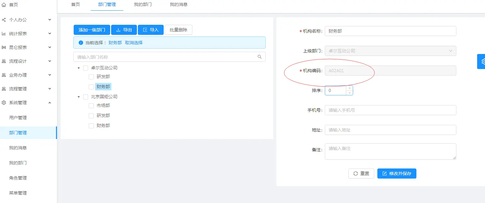

数据权限规则篇
===

### 一、功能说明
列表数据权限，主要通过数据权限控制行数据，让不同的人有不同的查看数据规则；
比如： 销售人员只能看自己的数据；销售经理可以看所有下级销售人员的数据；财务只看金额大于5000的数据等等；   


### 二、数据权限分两大类型

| 序号        | 类型   |     规则字段区别|  说明  |
| --------   | -----  |----  | ----  |
| 1     | 编码方式 |   规则字段是驼峰写法，对应mybatis实体的字段 |编码模式（通过代码生成器生成代码）     |
| 2        |   Online方式—作废 | 规则字段是下划线写法，对应表的字段 |   Online模式（在线表单模式，无代码）   |    


```
规则字段配置说明（非常重要）： 
①条件规则：大于/大于等于/小于/小于等于/等于/包含/模糊/不等于
②规则值：指定值 ( 固定值/系统上下文变量 )
  日期默认值格式：2020-04-10
  时间默认值格式：2020-04-13 12:00:00
③条件规则是包含： 规则值用逗号分隔
```     


### 三、数据权限规则篇   

#### 1.当前用户上下文变量
注意：数据权限配置，规则值可以填写系统上下文变量（当前登录人信息），从而根据当前登录人信息进行权限控制。

| 编码| 描述 |
| --------   | -----  | 
| sys_user_code| 当前登录用户登录账号|
| sys_user_name| 当前登录用户真实名称| 
| sys_date| 当前系统日期| 
| sys_time| 当前系统时间| 
| sys_org_code| 当前登录用户部门编号| 
| sys_multi_org_code| 当前登录用户拥有的所有机构编码，逗号分隔| 
| tenant_id| 当前登录用户租户ID   `要求：3.4.5 版本+` | 

规则值，配置写法如下：#{sys_user_code}   

#### 2.建表规范（系统标准字段）
如果需要通过当前登录人、登录部门，进行数据权限控制，则业务表必须有以下系统标准字段；`数据添加和编辑，jeecg会通过拦截器自动注入操作人的信息。`
比如：创建人，创建时间，创建人所属部门，有了这些标准字段，就可以通过当前登录人进行数据隔离控制；

| 字段英文名| 字段中文名| 
| --------   | -----  | ----  |
| create_by| 创建人账号| 
| create_time| 创建时间| 
| sys_org_code| 创建人登录部门| 

#### 3.组织机构邮编规则
JEECG组织机构支持无限层级，上下级关系通过组织机构编码实现，组织机构编码规则类似邮编方式，看下图；
邮编规则优势： 邮编规则，上下级编码固定规律，便于定位下级和上级；


