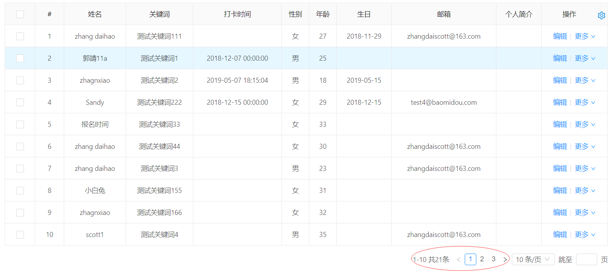
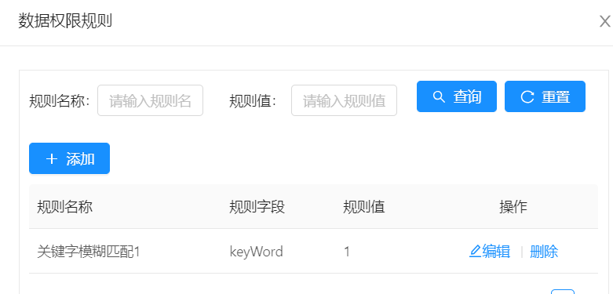
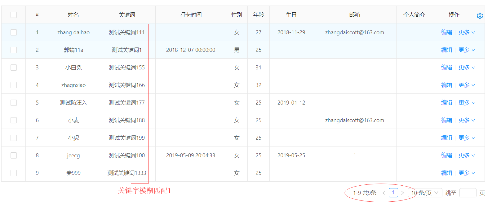

###  手工集成数据权限规则（未用查询过滤器）

> 前言：现有的列表数据权限，需要在后端list请求中调用QueryGenerator.initQueryWrapper方法，否则配置权限无法生效，故而本章节讲述的是如何手工获取数据权限，不通过上述方法，而是自己在外部处理。

准备案例：(`权限配置细节不作赘述，请查看相关文档`)

*  查看菜单 常见案例-->单表模型示例 ，没有权限时，数据如下：

*  配置一个数据权限规则如下图，并且授权

*  则过滤后的数据如下：


实现方案：
1.将数据权限规则转化成sql，程序拿到这个sql，可以拼接在mybatis的xml中
```
    // controller代码
    // 需要将前端将list请求地址改成此地址
	@GetMapping(value = "/sqlList")
	@PermissionData(pageComponent="jeecg/JeecgDemoList")
	public Result<IPage<JeecgDemo>> loadSqlPermissonList(JeecgDemo jeecgDemo, @RequestParam(name = "pageNo", defaultValue = "1") Integer pageNo, @RequestParam(name = "pageSize", defaultValue = "10") Integer pageSize,
			HttpServletRequest req) {
		Result<IPage<JeecgDemo>> result = new Result<IPage<JeecgDemo>>();
		IPage<JeecgDemo> pageList = jeecgDemoService.queryListWithPermission(pageSize, pageNo);
		result.setSuccess(true);
		result.setResult(pageList);
		return result;
	}

//service代码
public IPage<JeecgDemo> queryListWithPermission(int pageSize,int pageNo) {
		Page<JeecgDemo> page = new Page<>(pageNo, pageSize);
        //就是调用这个QueryGenerator.installAuthJdbc方法获取权限sql
		String sql = QueryGenerator.installAuthJdbc(JeecgDemo.class);
		return this.baseMapper.queryListWithPermission(page, sql);
	}

//mapper接口方法定义
IPage<JeecgDemo> queryListWithPermission(Page<JeecgDemo> page,@Param("permissionSql")String permissionSql);

//xml代码
	<select id="queryListWithPermission" parameterType="Object" resultType="org.jeecg.modules.demo.test.entity.JeecgDemo">
		select * from demo where 1=1 ${permissionSql}
	</select>

```
2.还是使用mybatisplus ，在外部自己往queryWrapper 里面设置，
```
    //contoller代码
    // 需要将前端将list请求地址改成此地址
	@GetMapping(value = "/mpList")
	@PermissionData(pageComponent="jeecg/JeecgDemoList")
	public Result<IPage<JeecgDemo>> loadMpPermissonList(@RequestParam(name = "pageNo", defaultValue = "1") Integer pageNo, @RequestParam(name = "pageSize", defaultValue = "10") Integer pageSize,
			HttpServletRequest req) {
		Result<IPage<JeecgDemo>> result = new Result<IPage<JeecgDemo>>();

        //此处使用的是QueryWrapper，如果你需要用LambdaQueryWrapper，请先new一个QueryWrapper，接着加载数据权限，然后通过queryWrapper.lambda()将其转化成LambdaQueryWrapper，最后你就能使用LambdaQueryWrapper处理自己的逻辑了
		QueryWrapper<JeecgDemo> queryWrapper = new QueryWrapper<JeecgDemo>();
        //调用这个QueryGenerator.installAuthMplus方法加载数据权限
		QueryGenerator.installAuthMplus(queryWrapper, JeecgDemo.class);
		Page<JeecgDemo> page = new Page<JeecgDemo>(pageNo, pageSize);

		IPage<JeecgDemo> pageList = jeecgDemoService.page(page, queryWrapper);
		result.setSuccess(true);
		result.setResult(pageList);
		return result;
	}
```
